<picture>
    <source media="(prefers-color-scheme: dark)" srcset="../images/microchip_logo_white_red.png">
	<source media="(prefers-color-scheme: light)" srcset="../images/microchip_logo_black_red.png">
    
</picture>

## Secure Boot and Secure Firmware Upgrade over CAN-FD for dsPIC33C DSCs Demo

## Introduction
The associated bootloader and application projects demonstrate the following: 
* Immutable secure boot via CodeGuard
* A/B type bootloading with Flash partitioning to support two firmware images and anti-roll back
* Secure boot authentication via ECDSA signature verification 
* Secure firmware update via CAN-FD
* Crypto acceleration via TA100

## Related Documentation
* [dsPIC33C Touch-CAN-LIN Curiosity Development Board User's Guide](https://www.microchip.com/en-us/development-tool/EV97U97A)
* [dsPIC33CK1024MP710 Datasheet](https://www.microchip.com/en-us/product/dsPIC33CK1024MP710) 

## Tools 

#### Software 
* **THIS PROJECT REQUIRES A NON PUBLIC COPY OF THE CRYPTOGRAPHIC AUTHENTICATION LIBRARY (CAL) FOR TA100 SUPPORT! CONTACT MICROCHIP TO OBTAIN A COPY. YOU MUST REQUEST VERSION CryptoAuthLib 3.6.1 or later**
* The unzipped example project files, boot.X and app.X
* [MPLAB® X IDE v6.15 or later](https://www.microchip.com/en-us/tools-resources/develop/mplab-x-ide)
* [MPLAB® XC16 v2.10 or later](https://www.microchip.com/en-us/tools-resources/develop/mplab-xc-compilers)
* [Universal Bootloader Host Application v1.19.3 or later](www.microchip.com/16-bit-bootloader) 
* Device Family Pack 1.12.354
* [MPLAB® Code Configurator (MCC) v5.6.1 or later (optional - for code configuration)](https://www.microchip.com/en-us/tools-resources/configure/mplab-code-configurator)
* 16-Bit Bootloader MCC module v1.25.0 or later (optional - for code configuration)
* The drivers for the selected Peak CAN-FD protocol analyzer/protocol generator (available at https://www.peak-system.com/Home.59.0.html?&L=1)

#### Hardware
* [dsPIC33C Touch-CAN-LIN Curiosity Development Board (EV97U97A)](https://www.microchip.com/en-us/development-tool/EV97U97A)
* A Peak CAN protocol analyzer/protocol generator. A PCAN-USB FD was used for development of this demo (https://www.peak-system.com/PCAN-USB-FD.365.0.html?&L=1)
* A CAN cable
* A CAN-FD bus terminator (or modify the Peak analyzer per their user's guide for proper CAN-FD termination)
* A micro USB cable, a USB-Type C cable, or a 9v power adapter for the dsPIC33C Touch CAN LIN Curiosity Development Board (for powering the board)
* [TA100 Trust Anchor External HSM 8-Pin SOIC](https://www.microchip.com/en-us/product/ta100)
* [TA100 8-Pin SOIC CryptoAutomotive™ Socket Board](https://www.microchip.com/en-us/development-tool/AC164167)

## Running the Demo

##### Hardware Setup
1. With the Development Board detached from any power source, programmer, or USB connection, connect the TA100 8-Pin SOIC CryptoAutomotive™ Socket board into the mikroBUS™ A slot with the jumpers set for SPI
2. Connect the Peak analyzer/generator to your computer
3. Connect the Peak analyzer/generator to the CAN/CAN-FD Driver Circuit on the Development Board
4. Connect the micro-USB cable to port J1 of the Development Board to the host computer.

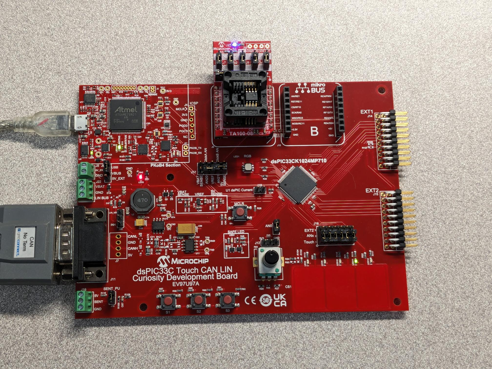

#### Programming the Bootloader
1. Open the boot.X project in MPLAB® X
2. Open MCC
3. Right click on Project Resources and select "Force Update on All"
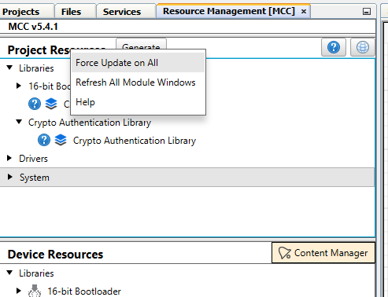
4. Click "Generate"

5. Accept all incoming code changes by selecting "Replace All" in the merge helper UI
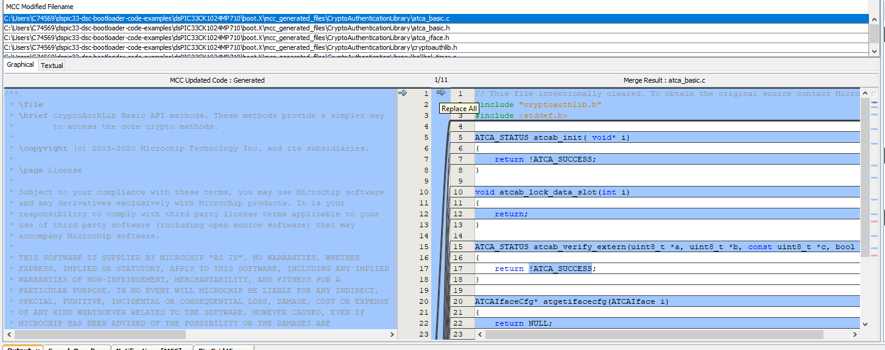
6. Press the “Make and Program” button on the top bar
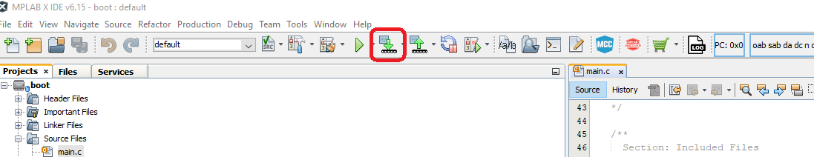
7. Select the appropriate programmer if prompted
8. The project should compile and program successfully
9. Verify the LED11 is solid on the Development Board. This indicates the bootloader is running
    a. If LED11 is blinking instead of solid, then the application code was programmed instead of only compiled. Go back to the “Programming the Bootloader” stage and re-program the bootloader
    
#### Building the Application
1. Open the app.X project in MPLAB® X
2. Press the “Clean and Build Project” button on the top bar. **NOTE**: Make sure not to hit the program button. This will program the application code over the bootloader that was just programmed
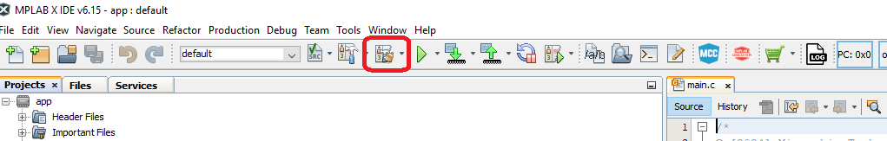
3. The project should compile cleanly. app.X/dist/default/production/app.X.production.hex should be generated
4. Verify that LED11 is still solid

#### Loading the Application
1. Open the Universal Bootloader Host Application tool (UBHA)
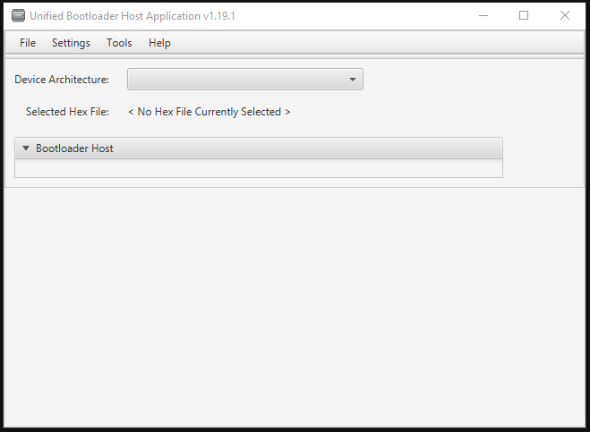
2. Select the “PIC24/dsPIC” option from the “Device Architecture” selection drop down
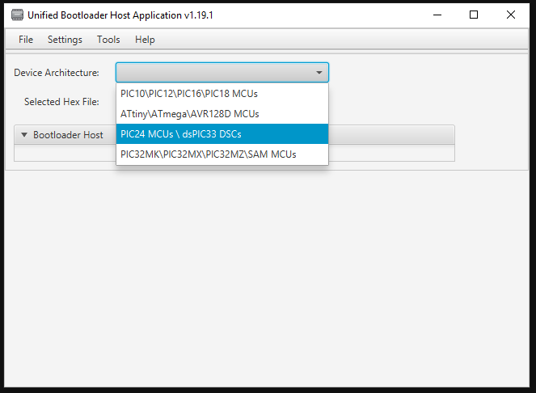
3. Select “CAN” from the protocol drop down selection box
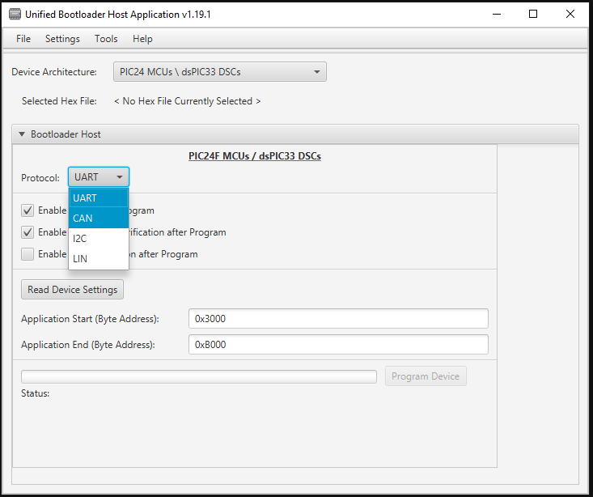
4. Select the “Settings->CAN” option from the top menu
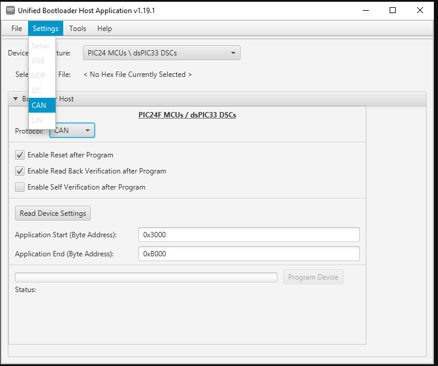
5. Select the Peak protocol analyzer being used and the appropriate CAN configuration settings for this demo (listed below). When complete, press “Apply”: 
    a. Nominal Bit Rate: 125.00 kbits/s
    b. CAN-FD: enabled
    c. CAN-FD TX Data Length: 8
    d. Flexible Data Rate: Enabled 
    e. Flexible Data Rate: 2Mbits/s
    f. Message Format: Standard
    g. Host to Device ID: 0xA1
    h. Device to Host ID: 0xA2
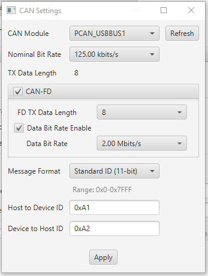
6. Press the "Read Device Settings" button
    a. The Application start address and Application end address fields should have updated. If it did not or if you get a communication error, please go back to the “Programming the Bootloader” stage to make sure the bootloader was programmed correctly
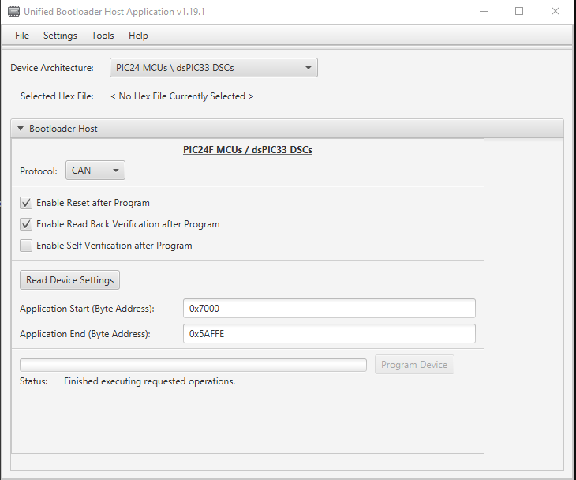
7. Load the application hex file by selecting “File->Open/Load File (*.hex)”
    a. Select the file generated in the previous section: app.X/dist/default/production/app.X.production.hex
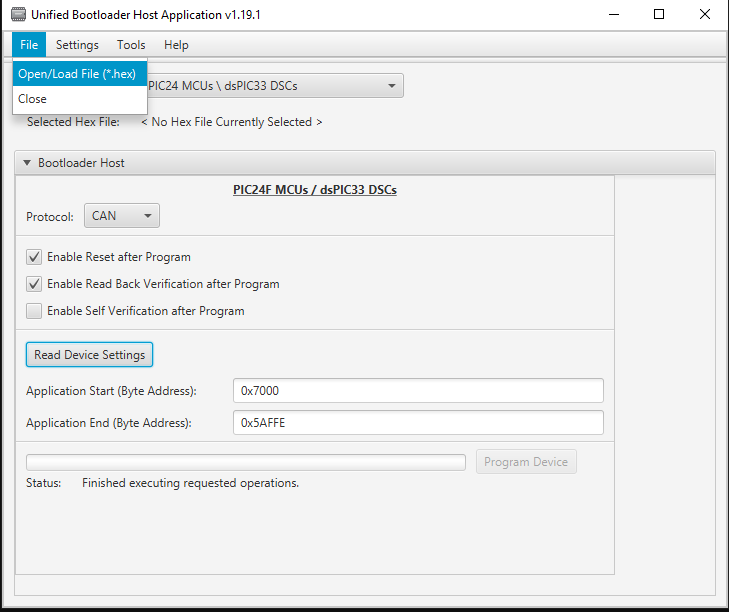
8. Check the "Enable Self Verification After Program" checkbox
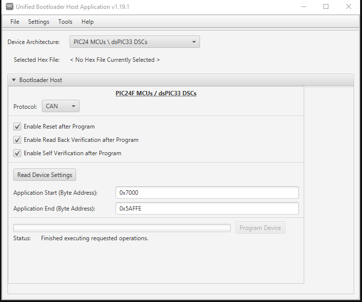
9. Press “Program Device”. The application should program erase, program and perform a self verify using the TA100 for an ECDSA verify then read back verify correctly. Note: The reset response may not be fully transmitted before reset which may result in the reset response failing. The reset most likely did occur and the error can be safely ignored. 
    a. After a few seconds, LED11 should be blinking
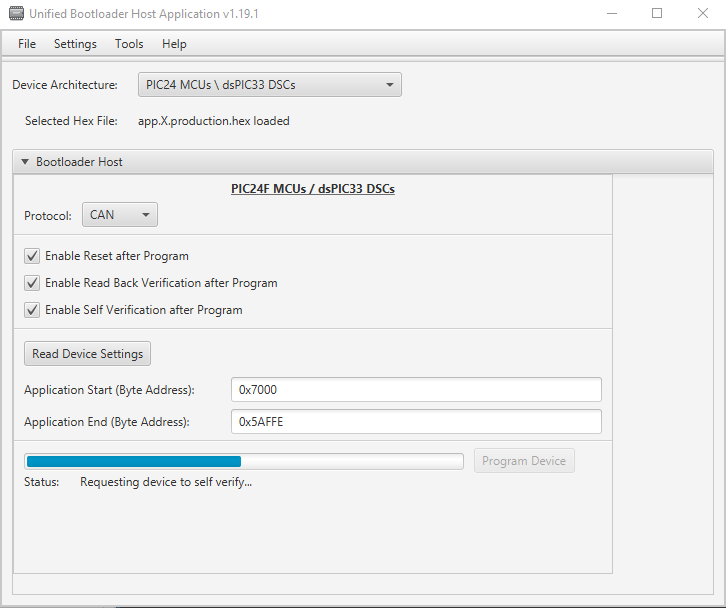

## Trademarks

MPLAB® is a registered trademark of Microchip Technology Inc. All other trademarks are the property of their respective owner.
