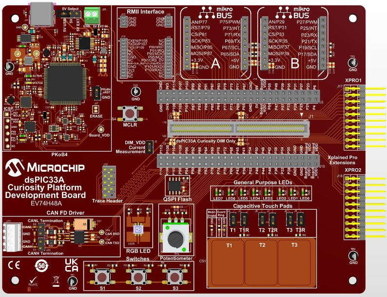
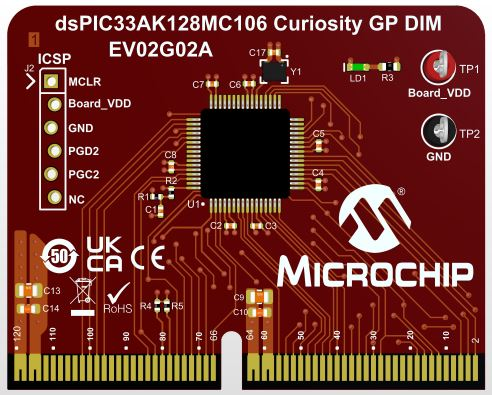
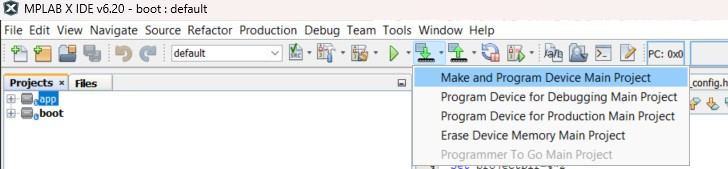
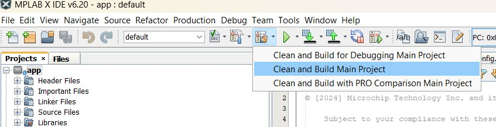
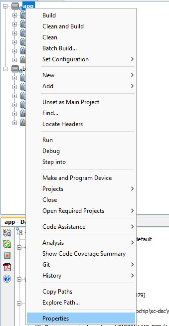
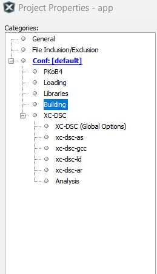
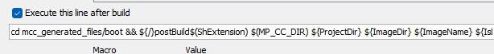
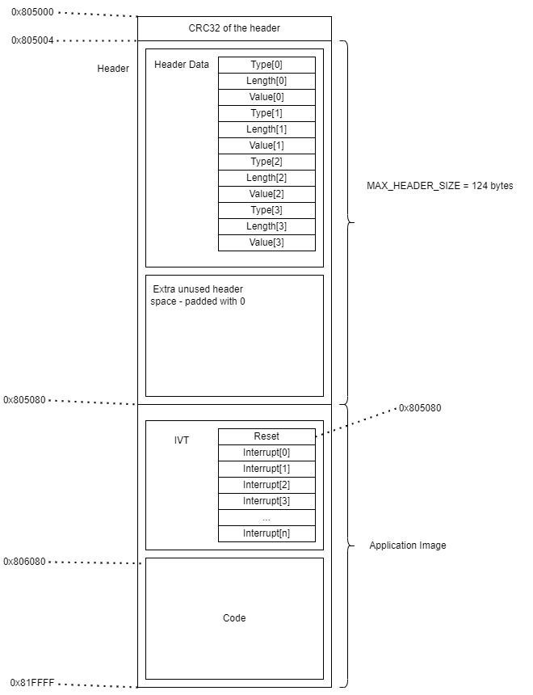
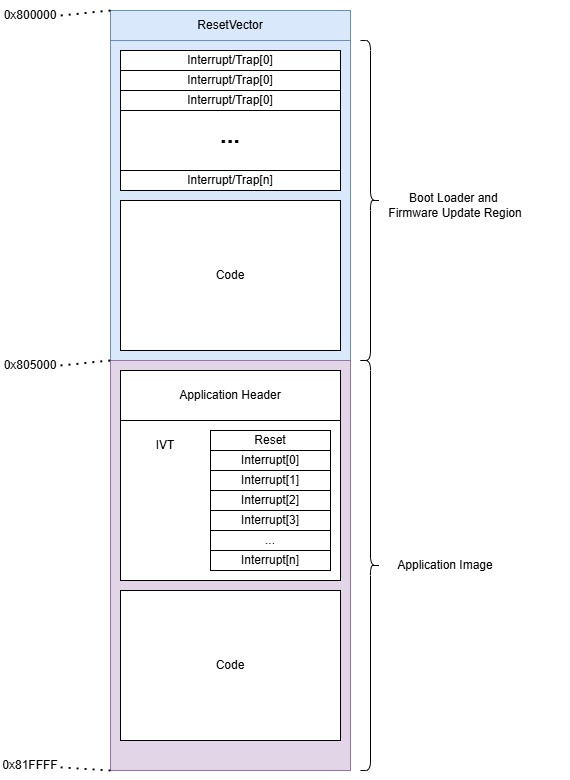

<picture>
    <source media="(prefers-color-scheme: dark)" srcset="images/microchip_logo_white_red.png">
	<source media="(prefers-color-scheme: light)" srcset="images/microchip_logo_black_red.png">
    
</picture>

## dsPIC33A Bootloader and Firmware Upgrade Demo

---

**NOTE: THIS DEMO IS AN ENGINEERING RELEASE TO DEMONSTRATE DSPIC33A BOOTLOADER FUNCTIONALITY AND SHOULD BE USED FOR REFERENCE ONLY. THIS CODE IS NOT INTENDED FOR USE IN PRODUCTION.**

---

<br>
_Figure 1. - dsPIC33A Curiosity Platform Development Board_<br><br>

<br>
_Figure 2. - dsPIC33AK128MC106 Curiosity GP DIM_<br><br>

## Introduction
The associated bootloader and application projects demonstrate the following:
* Firmware update via UART using Microchip Device Firmware Update (MDFU) protocol.
* Application verification checking using a 32-bit CRC-32Q signature.

## Related Documentation
* [dsPIC33AK128MC106 DIM (EV02G02A)](https://www.microchip.com/en-us/development-tool/ev02g02a)
* [dsPIC33A Curiosity Platform Development Board (EV74H48A)](https://www.microchip.com/en-us/development-tool/ev74h48a)
* [MDFU Protocol](https://ww1.microchip.com/downloads/aemDocuments/documents/DEV/ProductDocuments/SupportingCollateral/Microchip-Device-Firmware-Update-MDFU-Protocol-DS50003743.pdf)

## Tools 

### Software 
* The unzipped example project files, boot.X and app.X
* [MPLAB® X IDE v6.20 or later](https://www.microchip.com/en-us/tools-resources/develop/mplab-x-ide)
    * See [Programming and Debugging the dsPIC33A on MPLAB X IDE v6.20 and IPE v6.20](https://microchip.my.site.com/s/article/Programming-and-Debugging-the-dsPIC33A-on-MPLAB-X-IDE-v6-20-and-IPE-v6-20)
* [MPLAB® XC-DSC v3.10 or later](https://www.microchip.com/en-us/tools-resources/develop/mplab-xc-compilers/xc-dsc) for additional dsPIC33A project creation information 
* dsPIC33AK-MC_DFP (Device Family Pack) 1.0.33 or later
* [Python 3.9 or greater](https://www.python.org/)
* [pymdfu Python package](https://pypi.org/project/pymdfu/) (**NOTE**: version 2.5.1.9 used for this demo. The commands may change depending on the version used. See the [pymdfu release history](https://pypi.org/project/pymdfu/#history) for details


### Hardware
* [dsPIC33AK128MC106 DIM (EV02G02A)](https://www.microchip.com/en-us/development-tool/ev02g02a)
* [dsPIC33A Curiosity Platform Development Board (EV74H48A)](https://www.microchip.com/en-us/development-tool/ev74h48a)
* A USB-Type C cable (for powering the board)

## Running the Demo

### Hardware Setup
1. Insert the dsPIC33AK128MC106 Curiosity GP Dim into the dsPIC33A Curiosity DIM Connector.
2. Connect the USB-C cable to connector J24 of the Development Board to the host computer.

### Programming the Bootloader
1. Open the boot.X project in MPLAB® X.
2. Press the "Make and Program" button on the top bar.<br>
    <br>
    _Figure 3. - "Make and Program" button in MPLAB X_<br>
3. Select the appropriate programmer if prompted.
4. The bootloader project should compile and program successfully. LED0 should turn on to indicate the board is running the bootloader. 

### Building/Compiling the Application
1. Open the app.X project in MPLAB® X.
2. Click the dropdown arrow next to the “Clean and Build Project” button on the top bar and select "Clean and Build Main Project". <br>
    <br>
    _Figure 4. - "Clean and Build Project" button in MPLAB X_<br>

    This will compile the project and run the post build step as defined under "Project Properties" within the "Building" tab:<br>
    <br>
    _Figure 5. - Project properties_<br>

    <br>
    _Figure 6. - Building tab_<br>

    <br>
    _Figure 7. - Postbuild steps_<br>

    The postBuild.bat script ran in this step can be found under "mcc_generated_files --> boot". 
    <br>**NOTE**: If "Clean and Build for Debugging" is selected instead, a new .hex and associated .bin file will not be generated and the upgrade will not complete properly.</br>

### Application Post Build Details
The main purpose of postBuild.bat is to calculate the CRC values of the application image and the application header and generate the resulting .bin file for the MDFU host to use and transfer a new image to the application. The script uses Hexmate, an application that is included with the XC8 compiler that merges, reformats, and inserts data into hex files. Additional information and help docs for Hexmate can be found in the XC8 installation location on your PC under "docs". For example, "Program Files --> Microchip --> xc8 --> v3.00 --> docs". 

The commands ran in the postBuild.bat script are described below: 
1. The first command takes the application image ("app.X --> dist --> default --> production --> app.X.production.hex") and fills all unspecified memory locations in the application space [0x805000 - 0x81FFFF] with the value 0x00 using the Hexmate "-FILL" option. This ensures the resulting CRC hash value is accurate and no garbage values are included that may corrupt the CRC. The Hexmate "-CK" option is then used to calculate the CRC hash of the application space [0x805080 - 0x81FFFF] and places this in the MDFU_APPLICATION_HEADER_CODE_INTEGRITY location designated by the application header. See the Application Header section below for more details. The resulting .hex file is output as the original application image ("app.X --> dist --> default --> production --> app.X.production.hex").
 ```
 hexmate r0-FFFFFFFF,"%projectDir%\%imageDir%\%imageName%" -O"%projectDir%\%imageDir%\%imageName%" -FILL=w1:0x00@0x805000:0x81FFFF +-CK=805080-81FFFF@805024w-4g5p814141AB
 ```

 2. The second command is the same as the first command, except now the Hexmate options are ran over the application header space [0x805004 - 0x80507F]. Unspecified memory locations in the header space (including the location where the application header verification value is stored) are filled with the value 0x00 for accurate CRC hashing using the "-FILL" option. The "-CK" option is then used to calculate the CRC hash value of the header [0x805004 - 0x80507F]. This value is placed in the location designated for the application header verification (0x805000). Again the application image ("app.X --> dist --> default --> production --> app.X.production.hex") is used as the input and output.

 ```
 hexmate r0-FFFFFFFF,"%projectDir%\%imageDir%\%imageName%" -O"%projectDir%\%imageDir%\%imageName%" -FILL=w1:0x00@0x805000:0x81FFFF +-CK=805004-80507F@805000w-4g5p814141AB
 ```

3. The third command shifts the application image to address 0x00 to ensure only the application image is included in the final .hex and .bin file that will be downloaded to the client via the MDFU host. The Hexmate shift option is used below to shift the application space, including the header and the header verification location [0x805000 - 0x81FFFF] by 0x805000, which is where the application starts. The input of this command is the application image ("app.X --> dist --> default --> production --> app.X.production.hex") and the output is a new .hex file ("app.X --> dist --> default --> production --> bin.hex"). The application image remains unchanged by this step. 

```
hexmate r805000-81FFFFs-805000,"%projectDir%\%imageDir%\%imageName%" -O"%projectDir%\%imageDir%\bin.hex"
```
4. The forth and final step simply creates a .bin file from the bin.hex file created in Step 3 using the Hexmate options "-I ihex -O binary", indicating the input is a hex file and the desired output is a binary file. The resulting binary file is placed in "app.X --> dist --> default --> production --> app.X.production.bin".

```
%OBJ_CPY% -I ihex -O binary "%projectDir%\%imageDir%\bin.hex" "%projectDir%\%imageDir%\app.X.production.bin"
```

### Programming the Application
1. Once the application project has been built, open a command terminal from the root of the app.X project file.
2. In the command terminal, enter the following command to begin the firmware update:<br>
    ```
     pymdfu update --verbose debug --tool serial --image dist/default/production/app.X.production.bin --port COMXX --baudrate 460800
    ```   
    <br>**NOTE**: Replace "COMXX" with the correct communication port used in your setup. For example:</br>
    ```
     pymdfu update --verbose debug --tool serial --image dist/default/production/app.X.production.bin --port COM12 --baudrate 460800
    ```

    This command calls the pymdfu Python package to update the application using the Microchip Device Firmware Update (MDFU) protocol and the .bin file created in Step 2 of Building/Compiling the Application.
    <br>**NOTE**: Since debug is set in the pymdfu command above, the command terminal will show a detailed description of the packets being transferred. For a less verbose output, "--verbose debug" can be removed. Additional details on the pymdfu command usage can be found [here](https://pypi.org/project/pymdfu/).</br>

### Application Example Behavior
When the app.X firmware image transfer is complete, the application will start automatically after it is verified.  It will behave as follows:
* LED7 will blink using interrupts
* LED5 will blink using CPU delays
* Switch S1 can be pressed to re-enter boot mode

### Bootloader Re-Entry
The bootloader can be re-entered from the application without needing to re-program the board entirely. This can be done by doing the following: 
1. While the application is running, power off the board. 
2. Hold down the S1 button.
3. While continuing to hold down the S1 button, power the board back on.
4. LED0 should now be turned on, indicating the board is running the bootloader. 

## Application Details 

### Application Memory Map
The application consists of a header, the application image (containing the IVT), and the CRC of the header (prepended to the header) as diagrammed below:<br>
<br>
_Figure 8. - Application Memory Map_<br>

**NOTE**: The application header must end on an address modulo 0x40/IVTBASE must be 0x40 aligned. See the [dsPIC33AK128MC106 datasheet](https://ww1.microchip.com/downloads/aemDocuments/documents/MCU16/ProductDocuments/DataSheets/dsPIC33AK128MC106-Family-Data-Sheet-DS70005539.pdf), section "Interrupt Vector Base Address Register" for details. 

### Application Header

The application header contains a TLV (type-length-value) list of 4 entries:

| Type Name                                   | Type Value   | Length (bytes)*                      | Value                        | Description                                                                                                           |
| ------------------------------------------- | ------------ | ------------------------------------ | ---------------------------- | --------------------------------------------------------------------------------------------------------------------- | 
| MDFU_APPLICATION_HEADER_CODE_SIZE           | 0x00000001UL | 4                                    | 0x00003000                   | Number of bytes in the application image                                                                              |
| MDFU_APPLICATION_HEADER_CODE_VERSION_NUMBER | 0x00000002UL | 4                                    | 0x00010000                   | Value - 32-bit number in the format of 0x00MMmmpp where MM = major revision, mm = minor revision, pp = patch revision | 
| MDFU_APPLICATION_HEADER_CODE_INTEGRITY      | 0x00000003UL | 4 (varies by verification algorithm) | Calculated by CRC algorithm**|The primary integrity check value for the code that must be verified before execution is allowed                       |
| MDFU_APPLICATION_HEADER_CODE_END_OF_HEADER  | 0x00000000UL | 0                                    | Empty                        | Empty. Used to indicate the end of the used header space has been reached                                             |

*The length field is stored as a 32-bit value (i.e. a length of 4 is stored as 0x00000004)
**In the post build step, postBuild.bat calculates the MDFU_APPLICATION_HEADER_CODE_INTEGRITY value, placing it in the appropriate location as defined by the header (0x805024).

## Linker File, Project Properties, and MCC Library Modifications
The linker files (p33AK128MC106.gld) as well as a handful of project properties and library files in both boot.X and app.X have been modified for this project. The following sections contain descriptions of those changes and considerations to make when porting this demo to another device within the dsPIC33A family.

### Linker File Modifications 
The linker files for boot.X and app.X can be found in the root directory of each respective project and are both named "p33AK128MC106.gld". For comparison, the default linker files can be found where the XC-DSC compiler was installed. Typically this will be under, "Program Files --> Microchip --> xc-dsc --> v3.XX --> support --> dsPIC33A --> gld".

If porting this demo over to another dsPIC33A device, it is recommended that the device's default .gld file be used and the following modifications made. If the address values in the linker file are updated, ensure the associated values in mdfu_config.h are changed accordingly in both boot.X and app.X. Similarly, the values in postBuild.bat will need to be updated to reflect the changes made. See Application Post Build Details above for postBuild script details. 

#### Bootloader 
##### Memory Regions
* The "program (xr)" region has been shortened to accommodate the application. Specifically, the length has been decreased from 0x1F000 to 0x3FFF, ensuring the bootloader region ends at 0x804FFF immediately before the application region begins.
##### Memory Region Definitions 
* An "__IVT_BASE" definition has been added and set as 0x800004. This is used later in the linker file to define the bootloader's interrupt vector table.
##### Sections
* As noted above, an interrupt vector table section has been added with the location set as __IVT_BASE.

#### Application 

##### Memory Regions
* A "header_check" region has been added for the CRC value of the application header starting at 0x805000 with a length of 0x4. 
* A "header" region has been added for the application header starting immediately after the "header_check" at 0x805004 with a length of 0x7C.  
* A check was added to define the "app_reset" and "ivt" regions if a compiler version prior to XC-DSC 3.20 is used. Prior to XC-DSC 3.20, the remapped interrupt vector table needed to be defined and generated manually. In version 3.20 and later, this is generated automatically using the linker command line option, "--ivt=IVT_BASE" within the linker node in the Project Properties. The "app_reset" region falls immediately after the application header and has a length of 0x4. The ivt section's origin was updated from 0x800004 to 0x805084 to fall immediately after the app_reset. 
* The "program (xr)" region origin was modified to directly follow the application "ivt" region starting at 0x806080. The region length was shortened from 0x1FFFC to 0x19F80 to accommodate the bootloader and the modified sections described above. 

**NOTE**: If only a portion of the application "program (xr)" space is used, the size of this region may be decreased to speed up the upgrade time. If this is decreased, ensure the MDFU_CONFIG_APPLICATION_ADDRESS_HIGH values are updated accordingly in the boot.X and app.X mdfu_config.h files. 

##### Memory Region Definitions
* __APP_RESET was added as described above.
* __CODE_BASE was modified to match the program (xr) region as described above.
* __CODE_LENGTH modified to match the program (xr) region as described above.
* __IVT_BASE modified to match the ivt region as described above.

##### Sections
* An Interrupt Vector Table was defined for XC-DSC versions prior to 3.20. See above under "Memory Regions" for further details on this change. The location for this IVT is defined as __IVT_BASE as noted above. 

### Project Properties Modifications

#### Bootloader
None

#### Application
* A post build step was added under Project Properties --> Building --> Execute this line after build. This box should be checked and the following should be added if porting this to a new project:
```
cd mcc_generated_files/boot && ${/}postBuild$(ShExtension) $(MP_CC_DIR) ${ProjectDir} ${ImageDir} ${ImageName} ${IsDebug} && cd ${ProjectDir} && cd ${ImageDir}
```
This command will navigate to and run the postBuild.bat script, which generates the .bin file for the application image update. 

See Figures 5-7 for more details on how to locate Project Properties and the post build step. 

* Under Project Properties --> XC-DSC --> xc-dsc-ld, in the "Additional options" box, the option "--ivt=0x805080" was added. This automatically generates a remapped interrupt vector table in XC-DSC **v3.20 or later** at address 0x805080. This address may need to be adjusted if using a different device. If using a version prior to v3.20, the ivt section will need to be added via the linker file. See the Linker File Modifications section above for details on this addition. 
### MCC Library Modifications
If porting to another dsPIC33A device, the MCC generated files will need to be regenerated to work with the device's specific configurations. The following libraries within MCC need to be added/modified and generated: 

#### Bootloader
* Flash (Manually add to the project)
* UART (Manually add to the project)
    * For this project, the "Requested Baudrate" was updated to 460800.
    * Within the Pin Grid View, select the UXTX and UXRX pins.
* Clock (Pre-Added under Project Resources. Changes here are optional)
    * Under "Phase-Locked Loop 1", toggle "Enable PLL".
    * Under "System Clock (Clock Generator 1)" --> "Clock Source", select "PLL1 Out output" and toggle "Set Maximum System Frequency" on.

#### Application 
* Timer (Manually add to the project)
    * Select "TRM1" from the Timer PLIB Selector dropdown.
    * Update "Requested Timer Period" to 500ms.
* Clock (Pre-Added under Project Resources. Changes here are optional)
    * Same changes as noted above under the Bootloader section. 

### Additional Project File Modifications 
#### Bootloader and Application 
* The demo utilizes the files within the bsp (board support package) folders for both boot.X and app.X to configure the board's LEDs and buttons. If porting to a different dsPIC33A device, the ports and pin numbers will need to be modified in the .c files therein. See the device's datasheet for pinout details. 

## Device Configuration
This demo has some device configuration that is an important part of the solution.  The dsPIC33A family of devices have a flexible flash programming security module that is utilized in this demo.  This section describes how the module is configured and used in this demo.  For more complete information about the module, please refer to the device datasheet.

### General Description
In this demo we are creating two firmware regions as shown in the _Figure 9_ below:
* The boot loader region which includes the firmware update capability
* The application region 

<br>
_Figure 9. - System Memory Map_<br>

Depending on the mode of operation, we want these regions to have different configurations:
* For the boot loader region, on reset, we want this code to be executable, integrity checked, and write protected.
* For the application region, on reset, we want this code to be non-executable, integrity checked, and write protected.  
* When we enter firmware update mode, we want to switch the application region to non-executable, integrity checked, and writable.
* When we have verified the integrity of the application image and are ready to transfer control to the application from the boot loader, we want to switch the application region to executable, integrity checked, and write protected.

### Bootloader Region Configuration
In this demo flash protection region 0 is used for the boot firmware (PR0).

As shown in _Figure 9_ the boot region resides in address range 0x800000-0x804FFF (inclusive).  To configure PR0 to this range, we configure the PR0ST register to 0x000 and the PR0END to 0x004.  *NOTE* - the PRnST and PRnEND registers are offset from 0x800000 and are page aligned (the lower bits are hardware restricted to force page alignment).  These options are set in the configuration bits FPR0ST and FPR0END which are copied into the PR0ST and PR0END SFRs on reset.

As noted in the description above, we want to configure the boot region to be executable, integrity checked, and write protected on reset.  These options are set in the FPR0CTRL configuration register and copied into the PR0CTRL SFR on reset.  The read bit (RD) also needs to be enabled for the CPU to access the code.  Finally, the region needs to be enabled.  *NOTE* the configuration bit is a DISABLE bit so take note on the setting when making changes.

By using the configuration bits, this ensures that the registers are loaded with the default behavior on reset.  There is an additional SFR for each region that doesn't have a configuration bit counterpart, the PRxLOCK register.  By default on reset this register is locked.  The locked state prevents changes to the register but allows them to be unlocked.  For the boot region, we do not want this region permissions to be changed so on initialization, we switch the lock setting from "locked" to "locked until next reset" preventing further unlocking.  

*NOTE* - This configuration is used to facilitate ease of change/modification.  The dsPIC33A has permanent configuration options that lock the boot region from any changes on reset and can't be unlocked or modified, even by reprogramming.  Please see the "Production Concerns" section below and the datasheet for additional information about these settings.

### Application Region Configuration
In this demo flash protection region 1 is used for the application firmware (PR1).

As shown in _Figure 9_ the application region resides in address range 0x805000-0x81FFFF (inclusive).  To configure PR1 to this range, we configure the PR1ST register to 0x005.  We can leave the PR1END to the default 0x7FF to include all the rest of memory.  *NOTE* - the PRnST and PRnEND registers are offset from 0x800000 and are page aligned (the lower bits are hardware restricted to force page alignment).  These options are set in the configuration bits FPR1ST and FPR1END which are copied into the PR1ST and PR1END SFRs on reset.

As noted in the description above, we want to configure the application region to be non-executable, integrity checked, and write protected on reset.  These options are set in the FPR1CTRL configuration register and copied into the PR1CTRL SFR on reset.  Finally, the region needs to be enabled.  *NOTE* the configuration bit is a DISABLE bit so take note on the setting when making changes.

By using the configuration bits, this ensures that the registers are loaded with the default behavior on reset.  There is an additional SFR for each region that doesn't have a configuration bit counterpart, the PRxLOCK register.  By default on reset this register is locked.  The locked state prevents changes to the register but allows them to be unlocked.  This is important for being able to do firmware updates.  We will want to change the configuration of this section depending on the mode we are running in.    

When we detect a firmware update is needed, the application region permissions are changed to enable writes, but keeps execution disabled.  When the update is complete, writes can be disabled again.  In this demo that is done by resetting the device as soon as a firmware update is complete to reset the boot process and thus restoring the reset protection of the application image: non-executable, write protected, integrity checked.

When the firmware update is complete, or on a reset, if the application passes all integrity checks and is determined valid, the firmware region can be switched to enable execution.  Before transferring control to the application code to run, we also want to lock the application region to "lock until next reset" so that the application code is unable to modify itself, either accidentally or through malicious intent.  Only the firmware update code in the boot region is allowed to update the application section.

### Production Concerns
This demo is meant to be a *non-permanent* example of boot loading on the dsPIC33A.  This allows the user to program/erase the device to customize the example without locking their device into a specific configuration.

For production, however, a permanent boot loader section is often preferred.  This can be accomplished by changing the region type for the bootloader to IRT, enabling the configuration write/erase locks, and enabling the ICSP inhibit features of the device.  These steps should be done by the developer before moving to production if stronger protections of the boot region are required.  

The configuration bits have their own write/erase protection mechanisms described in the datasheet.  These bits must be set in production to prevent accidental or malicious re-write of the configuration bit pages.  There are additional features to disable the programming/JTAG ports on the device that should be configured to lock the configuration bit pages, thus locking the flash protection region configuration.  These options are not enabled in the demo to allow reuse of the development hardware but should be enabled for production purposes.

### Demonstrating Flash Protection Regions
An addition example application project is included in this demo named "flashProtectionExample.X".  This example application tries to:
* Unlock the boot region and write to it
* Unlock the application region and write to it

This application is meant to be loaded via the firmware update mechanisms described in the main demo.  Adjust the steps above to use the project folder for this project. 

Once loaded, this firmware will:
* blink LED7 as a "keep alive" indicator
* blink LED6 if the boot region is successfully erased
* blink LED5 if the application region is successfully erased
* put a solid LED6 if the boot region was not successfully erased
* put a solid LED5 if the application region was not successfully erased

The developer can use this to verify the boot and application sections are locked to modification.  By modifying the boot loader code, the developer can also verify that if these regions are not switched to "locked until next reset", these regions can be unlocked and modified.  

### Converting to use loadable projects
Some developers prefer to use the loadable project features in MPLAB® X so that a bootloader and application project can be built into one .hex file.  This feature is supported by this demo, but requires some modifications to the examples provide.  The steps to enable loadable projects are:
1. Open the mdfu_config.h file in the app.X project.
2. Uncomment the MDFU_CONFIG_LOADABLE_PROJECT definition so that it is defined.
3. Open the linker file attached to the app.X project
4. Locate and uncomment the MDFU_CONFIG_LOADABLE_PROJECT definition so that it is defined.
5. Right click on the "Loadables" logical folder in the app.X MPLAB® X project. 
6. Select the boot.X as the loadable project.
7. Compile the project.  Two .hex files are generated in the production folder: one with just the application and one that is unified with the boot .hex file.  Both files have the CRC calculations applied to them.  The resulting .bin file only contains the application image and does not contain the boot loader source.

**NOTE** - The loadable projects support above is only available in MPLAB® XC-DSC compiler version 3.20 or later.

## Trademarks

MPLAB® is a registered trademark of Microchip Technology Inc. All other trademarks are the property of their respective owner.
