<picture>
    <source media="(prefers-color-scheme: dark)" srcset="images/microchip_logo_white_red.png">
	<source media="(prefers-color-scheme: light)" srcset="images/microchip_logo_black_red.png">
    
</picture>

# dsPIC33A Secure Boot and Secure Firmware Upgrade Demo

---

**NOTE: THIS DEMO IS AN ENGINEERING RELEASE TO DEMONSTRATE DSPIC33A BOOTLOADER FUNCTIONALITY AND SHOULD BE USED FOR REFERENCE ONLY. THIS CODE IS NOT INTENDED FOR USE IN PRODUCTION.**

---

<br>
_Figure 1. - dsPIC33A Curiosity Platform Development Board_<br><br>

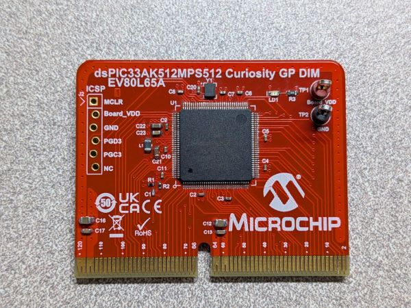<br>
_Figure 2. - dsPIC33AK512MPS512 Curiosity GP DIM_<br><br>

## Introduction
The associated bootloader and application projects demonstrate the following:
* Secure firmware update via UART using the Microchip Device Firmware Update (MDFU) protocol.
* Secure boot authentication via ECDSA P\-384 sign and verify using Crypto Accelerator Module (CAM) hardware.
* A/B type bootloading with Flash partitioning to support two firmware images and anti-roll back.

## Related Documentation 
* [Curiosity Platform Development Board (EV74H48A)](https://www.microchip.com/en-us/development-tool/ev74h48a)
* [MDFU Protocol](https://ww1.microchip.com/downloads/aemDocuments/documents/DEV/ProductDocuments/SupportingCollateral/Microchip-Device-Firmware-Update-MDFU-Protocol-DS50003743.pdf)

## Tools 

### Software 
* The unzipped example project files, boot.X and app.X
* [MPLAB® X IDE v6.25 or later](https://www.microchip.com/en-us/tools-resources/develop/mplab-x-ide)
* [MPLAB® XC-DSC v3.21 or later](https://www.microchip.com/en-us/tools-resources/develop/mplab-xc-compilers/xc-dsc)
* dsPIC33AK-MP_DFP (Device Family Pack) 1.0.81 or later
* [Python 3.9 or greater](https://www.python.org/)
* [pymdfu Python package](https://pypi.org/project/pymdfu/) 
    * **NOTE**: Version 2.5.1.9 is used for this demo. The commands may change depending on the version used. See the [pymdfu release history](https://pypi.org/project/pymdfu/#history) for details
* Cryptographic Accelerator Module (CAM) driver for dsPIC33AK512MPS512 version 1.0.0

### Hardware
* [dsPIC33AK512MPS512 DIM (EV80L65A)](https://www.microchip.com/EV80L65A)
* [dsPIC33A Curiosity Platform Development Board (EV74H48A)](https://www.microchip.com/en-us/development-tool/ev74h48a)
* A USB-Type C cable (for powering the board)

## Running the Demo

### Hardware Setup
1. Insert the dsPIC33AK512MPS512 Curiosity GP Dim into the dsPIC33A Curiosity DIM Connector.
2. Connect the USB-C cable to connector J24 of the Development Board to the host computer.

### Programming the Bootloader
1. Open the boot.X project in MPLAB® X.
2. Press the "Make and Program" button on the top bar, selecting the appropriate programmer if prompted.<br>
    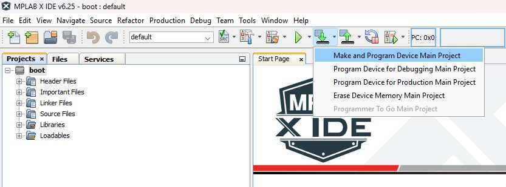<br>
    _Figure 3. - "Make and Program" button in MPLAB X_<br>

    The bootloader project is configured with a pre-build step that will be automatically ran when making and programming the device. The pre-build step can be found under "Project Properties" within the "Building" tab:<br>
    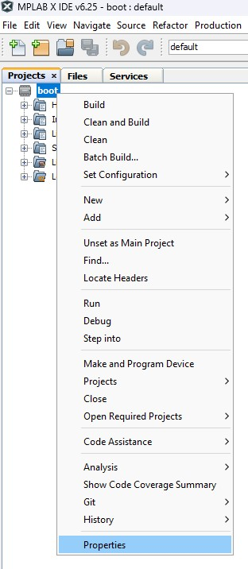<br>
    _Figure 4. - Project properties_<br>

    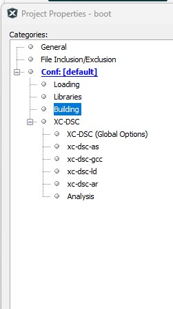<br>
    _Figure 5. - Building tab_<br>

    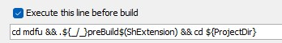<br>
    _Figure 6. - Pre-build steps_<br>

    The preBuild.bat script ran in this step can be found within the mdfu directory and is described in greater detail [below](#bootloader-pre-build-and-keystore-generation). 
3. The bootloader project should compile and program successfully. LED0 should turn on to indicate the board is running the bootloader. 

### Bootloader Pre-Build and Keystore Generation
The purpose of the pre-build step is to generate a unique key pair for each user and inject the public key from this pair into the keystore source file. This step is critical because distributing the same public/private key pair across all users of this demo could lead to security vulnerabilities if the key pair were ever exposed in a production environment. A compromised private key would allow malicious actors to alter data and create fraudulent signatures, undermining the security, trust, and functionality of the cryptographic systems in place.

<div style="background-color: yellow; padding: 10px; border: 1px solid black;">
  NOTE: Keys generated automatically in this demo ARE NOT SECURE.  Key pairs should be generated in a secure environment, like an HSM, where the private key is protected and has authenticated access/usage.  The keys generated are for demo purposes only.  Please see the 'Key Updates' section below of details about how modify the demo to use securely generated key pairs.
</div>

<br>
The script contains two main commands:<br>

```
    python3 create_demo_key_files.py || Error
```   

```
    python3 generate_keystore.py || Error
```
1. create_demo_key_files.py
    The create_demo_key_files.py script checks whether the keystore already exists. If it does not, the script generates a new keystore and key pair. The keystore directory is located under mdfu/keystore and contains the following files:
    * keystore.json: Describes the keystore structure, including the type of keys to be generated and the public key name.
    * public_key.pem: The public key file (default name).
    * private_key.pem: The private key file (default name).
    An example keystore.json file might look like this: 

```
    [
        {
            "format": "1.0.0",
            "keys": [
                {
                    "name": "Executable Partition Code Signing Public Key",
                    "type": "secp384r1",
                    "path": "public_key.pem",
                    "demo": "true"
                }
            ]
        }
    ]
```   
If keystore.json already exists, the script assumes that the keys have been generated and exits without making changes.

2. generate_keystore.py
The generate_keystore.py script locates the public key file specified in keystore.json within the keystore directory. It then injects the public key bytes into the generated_keystore.S file, which is used by the bootloader.

If keystore.json is missing, the script will exit with an error message. The generated_keystore.S file is located in the root directory of boot.X and should not be manually modified.

#### Key Updates
To update the code signing key used in the demo to a securely generated public key:
* Copy the new public key into the keystore directory.
* Modify the "path" field of the keystore.json file to point to the public key file that should be used for code signature verification.
* Remove the "demo" field from the key.  This is used to mark that the key is for demo purposes only.
* Re-run generate_keystore.py to regenerate the generated_keystore.S file with the updated public key.  This will automatically happen when the bootloader project is compiled.

### Building/Compiling the Application
1. Open the app.X project in MPLAB® X.
2. Click the dropdown arrow next to the “Clean and Build Project” button on the top bar and select "Clean and Build Main Project". <br>
    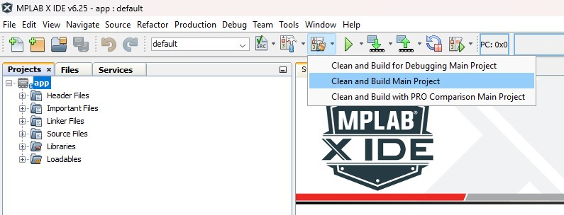<br>
    _Figure 7. - "Clean and Build Project" button in MPLAB X_<br>

    This will compile the project and run the pre and post build steps as defined under "Project Properties" within the "Building" tab:<br>
    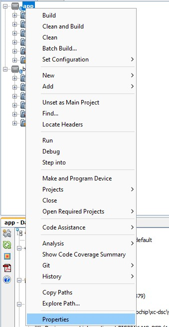<br>
    _Figure 8. - Project properties_<br>

    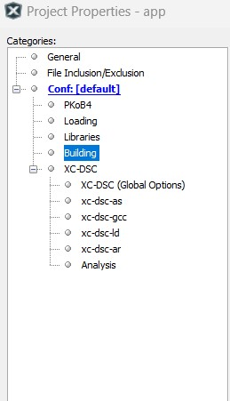<br>
    _Figure 9. - Building tab_<br>

    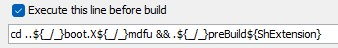<br>
    _Figure 10. - Pre-Build steps_<br>

    <br>
    _Figure 11. - Post Build steps_<br>

    The preBuild.bat script ran in the pre-build step above can be found in the boot.X project under "boot.X &rarr; mdfu". Additional details on the commands contained within the pre-build script can be found in [Bootloader Pre-Build and Keystore Generation](#bootloader-pre-build-and-keystore-generation) section.

    <br>**NOTE**: The bootloader's pre-build script is ran in the application to ensure that the application project builds successfully if built without the bootloader. This step can be removed if the bootloader is built first and a valid private key is generated as a result.
    
    <br>The postBuild.bat script ran in the post build step above can be found under "mcc_generated_files &rarr; boot". Additional details on the commands contained within the post build script can be found in the [Application Post Build Details](#application-post-build-details) section.

    <br>**NOTE**: If "Clean and Build for Debugging" is selected instead, a new .hex and associated .bin file will not be generated and the upgrade will not complete properly.</br>

### Application Post Build Details
The primary purpose of the post build script is to generate a fully signed executable image in binary format. This image is used by the MDFU host to transfer a new executable image to the target device.

The script utilizes several tools and utilities:

* Hexmate: A utility included with the XC8 compiler that merges, reformats, and inserts data into hex files. Documentation for Hexmate can be found in the XC8 installation directory on your PC (e.g., Program Files → Microchip → xc8 → v3.00 → docs).
* OpenSSL: Used for hashing and signing operations.
* Python Helper Scripts: Includes update_header_value.py, signing_tool.py, and bin_tool.py for various processing tasks.

Below is a step-by-step description of the commands executed in the postBuild.bat script:
1. Fill unimplemented memory locations in the executable space with 0x00 using Hexmate. This ensures the memory is properly initialized.<br>
    ```
    hexmate r80B000-0x844FFF,"%projectDir%\%imageDir%\%imageName%" -O"%projectDir%\%imageDir%\filled.hex" -FILL=w1:0x00@0x80B000:0x844FFF
    ```
2. Generate a binary file of the header data using Hexmate. The first command extracts just the header portion of the .hex file created in Step 1 (offset to address 0). The second command converts the header.hex file to binary format.<br>
    ```
    hexmate r80B060-0x80B1FFs-80B060,"%projectDir%\%imageDir%\filled.hex" -O"%projectDir%\%imageDir%\header.hex"

    %OBJ_CPY% -I ihex -O binary "%projectDir%\%imageDir%\header.hex" "%projectDir%\%imageDir%\header.bin"
    ```  
3. Generate a binary file of the executable code using Hexmate. The first command extracts just the executable code portion of the .hex file created in Step 1 (offset to address 0). The second command converts the data.hex file to binary format.<br>
    ```
    hexmate r80B200-0x844FFFs-80B200,"%projectDir%\%imageDir%\filled.hex" -O"%projectDir%\%imageDir%\data.hex"

    %OBJ_CPY% -I ihex -O binary "%projectDir%\%imageDir%\data.hex" "%projectDir%\%imageDir%\data.bin"
    ```  
4. Compute the SHA\-384 hash of the executable code. The first command outputs the hash to the terminal, while the second saves the hash in binary format.<br>  
    ```
    openssl dgst -sha384 "%projectDir%\%imageDir%\data.bin"

    openssl dgst -sha384 -binary -out "%projectDir%\%imageDir%\data.hash.bin" "%projectDir%\%imageDir%\data.bin"
    ```  
5. Inject the SHA\-384 digest of the executable code into the header binary file using update_header_value.py. The type_code argument (0x3) specifies that the data being injected is of type MDFU_PARTITION_HEADER_INTEGRITY. Refer to mdfu_partition_header.h for header type codes.<br> 
    ```
    python update_header_value.py update_header_value --header_bin "%projectDir%\%imageDir%\header.bin" --type_code 0x3 --value_bin "%projectDir%\%imageDir%\data.hash.bin"
    ```  
6. Compute the SHA\-384 hash of the header binary file and sign the hash using the private key stored in the keystore. The signature is saved in .der format.<br> 
    ```
    openssl dgst -sha384 "%projectDir%\%imageDir%\header.bin"

    openssl dgst -sha384 -sign "..\..\private_key.pem" -out "%projectDir%\%imageDir%\signature.der" "%projectDir%\%imageDir%\header.bin"
    ```  
7. Convert the signed header .der file to binary format using signing_tool.py.<br>
    ```
    python signing_tool.py -export "%projectDir%\%imageDir%\signature.der" "%projectDir%\%imageDir%\signature.bin" 384
    ```
8. Combine the signature, header, and executable data binary files into a single signed binary file using bin_tool.py. Each file is injected at specific offsets:

    * Signature: Injected at offset 0x0.
    * Header: Injected at offset 0x60 (size of the signature).
    * Executable Data: Injected at offset 0x200 (size of the signature + header).<br> 
    ```
    python bin_tool.py inject_bin --out_bin "%projectDir%\%imageDir%\signed_image.bin" --offset 0x0 --in_bin "%projectDir%\%imageDir%\signature.bin"

    python bin_tool.py inject_bin --out_bin "%projectDir%\%imageDir%\signed_image.bin" --offset 0x60 --in_bin "%projectDir%\%imageDir%\header.bin"

    python bin_tool.py inject_bin --out_bin "%projectDir%\%imageDir%\signed_image.bin" --offset 0x200 --in_bin "%projectDir%\%imageDir%\data.bin"
    ```

### Programming the Application
1. Once the application project has been built, open a command terminal from the root of the app.X project file.
2. In the command terminal, enter the following command to begin the firmware update:<br>
    ```
     pymdfu update --verbose debug --tool serial --image dist/default/production/signed_image.bin --port COMXX --baudrate 460800
    ```   
    <br>**NOTE**: Replace "COMXX" with the correct communication port used in your setup. For example:</br>
    ```
     pymdfu update --verbose debug --tool serial --image dist/default/production/signed_image.bin --port COM12 --baudrate 460800
    ```

    This command calls the pymdfu Python package to update the application using the Microchip Device Firmware Update (MDFU) protocol and the .bin file created in Step 2 of [Building/Compiling the Application](#buildingcompiling-the-application).
    <br>**NOTE**: Since debug is set in the pymdfu command above, the command terminal will show a detailed description of the packets being transferred. For a less verbose output, "--verbose debug" can be removed. Additional details on the pymdfu command usage can be found [here](https://pypi.org/project/pymdfu/).</br>

### Application Example Behavior
When the app.X firmware image transfer is complete, the executable will start automatically after it is verified. It will behave as follows:

* LED7 will blink using interrupts
* LED5 will blink using CPU delays
* Switch S3 can be pressed to re-enter boot mode 

### Bootloader Re-Entry
The bootloader can be re-entered from the executable without needing to re-program the board entirely. This can be done by doing the following: 
1. While the executable is running, power off the board. 
2. Hold down the S3 button.
3. While continuing to hold down the S3 button, power the board back on.
4. LED0 should now be turned on, indicating the board is running the bootloader. 

## Image Upgrade Process 

While performing an image upgrade, there are several outcomes depending on the following factors: 

* Executable partition validity
* Download partition validity
* Download partition version versus executable partition version 

Depending on the current state of the executable and download partitions, the possible outcomes are: 

* **RECEIVE UPGRADE**<br>

| Executable Partition Validity | Download Partition Validity | Download Partition > Executable Partition |
| ----------------------------- | --------------------------- | ----------------------------------------- |
|           Invalid             |           Invalid           |                     No                    |
|           Invalid             |           Invalid           |                     Yes                   |

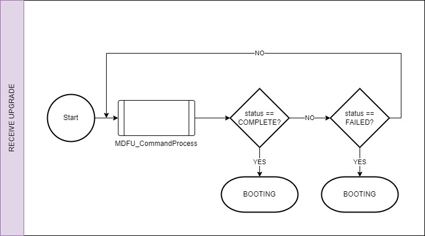<br>
_Figure 12. - Receive Upgrade Flow_<br>

* **RECOVER FROM DOWNLOAD**<br>

| Executable Partition Validity | Download Partition Validity | Download Partition > Executable Partition |
| ----------------------------- | --------------------------- | ----------------------------------------- |
|           Invalid             |           Valid             |                     No                    |
|           Invalid             |           Valid             |                     Yes                   |

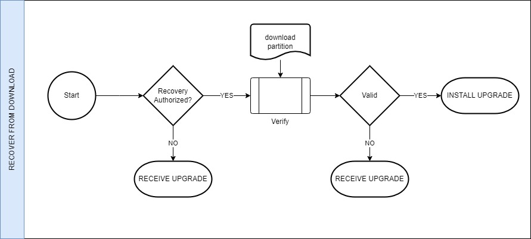<br>
_Figure 13. - Recover From Download Flow_<br>

* **LAUNCH EXECUTABLE**<br>

| Executable Partition Validity | Download Partition Validity | Download Partition > Executable Partition |
| ----------------------------- | --------------------------- | ----------------------------------------- |
|           Valid               |           Invalid           |                     No                    |
|           Valid               |           Invalid           |                     Yes                   |
|           Valid               |           Valid             |                     No                    |

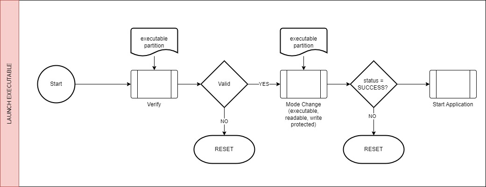<br>
_Figure 14. - Launch Executable Flow_<br>

* **INSTALL UPGRADE**<br>

| Executable Partition Validity | Download Partition Validity | Download Partition > Executable Partition |
| ----------------------------- | --------------------------- | ----------------------------------------- |
|           Valid               |           Valid             |                     Yes                   |

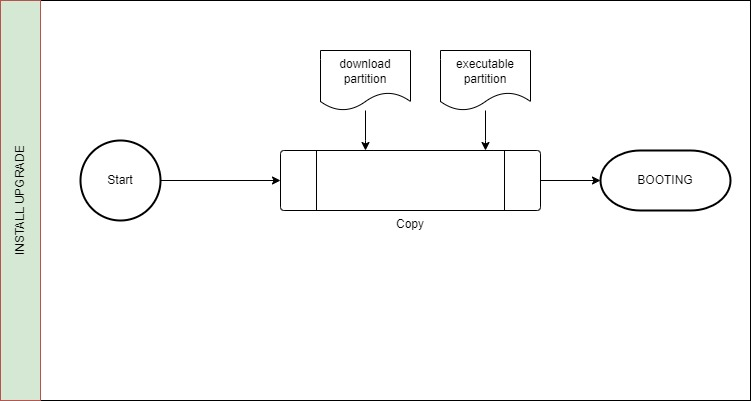<br>
_Figure 15. - Install Upgrade Flow_<br>

* <u>**Other States**</u>
Two other states of note that occur as a result of the flows mentioned above are BOOTING and RESET
    * **BOOTING**<br>
        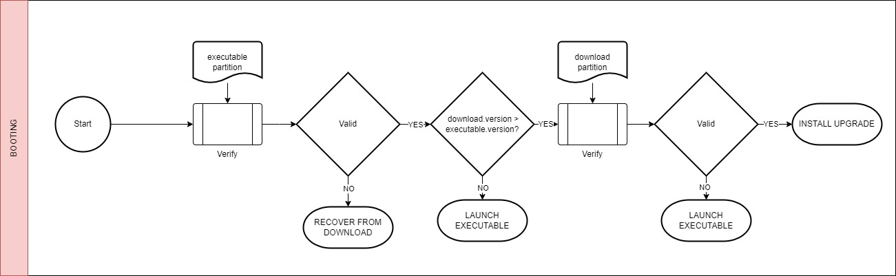<br>
        _Figure 16. - Booting Flow_<br>
        <br>
    * **RESET**<br>
        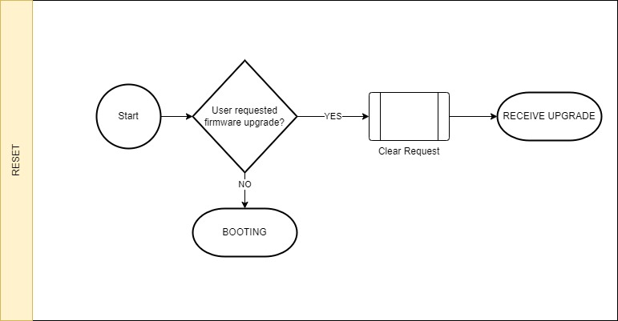<br>
        _Figure 17. - Reset Flow_<br>

## Executable Details

### Executable Memory Map
The executable consists of a header, the executable image (containing the IVT), and the signature of the header (prepended to the header) as diagrammed below:

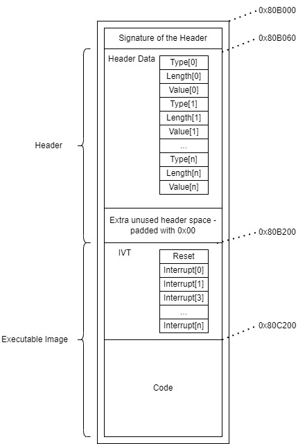<br>
_Figure 18. - Executable Memory Map_<br>

### Executable Header

The executable header contains a TLV (type-length-value) list of 4 entries:

| Type Name                                   | Type Value   | Length (bytes)*                      | Value                        | Description                                                                                                           |
| ------------------------------------------- | ------------ | ------------------------------------ | ---------------------------- | --------------------------------------------------------------------------------------------------------------------- | 
| MDFU_PARTITION_HEADER_CODE_SIZE           | 0x00000001UL | 4                                    | 0x00039E00                   | Number of bytes in the executable image                                                                              |
| MDFU_PARTITION_HEADER_CODE_VERSION_NUMBER | 0x00000002UL | 4                                    | 0x00010000                   | Value - 32-bit number in the format of 0x00MMmmpp where MM = major revision, mm = minor revision, pp = patch revision | 
| MDFU_PARTITION_HEADER_CODE_INTEGRITY      | 0x00000003UL | 48 (varies by verification algorithm) | The digest of the executable code**|The primary integrity check value for the code that must be verified before execution is allowed                       |
| MDFU_PARTITION_HEADER_CODE_END_OF_HEADER  | 0x00000000UL | 0                                    | Empty                        | Empty. Used to indicate the end of the used header space has been reached                                             |

*The length field is stored as a 32-bit value (i.e. a length of 4 is stored as 0x00000004)</br>
**In the post build step, postBuild.bat calculates the MDFU_PARTITION_HEADER_CODE_INTEGRITY value, placing it in the appropriate location as defined by the header.

## Linker File, Project Properties, and MCC Library Modifications
The linker files (p33AK512MPS512.gld) as well as a handful of project properties and library files in both boot.X and app.X have been modified for this project. The following sections contain descriptions of those changes and considerations to make when porting this demo to another device within the dsPIC33A family.

### Linker File Modifications 
The linker files for boot.X and app.X can be found in the root directory of each respective project and are both named "p33AK512MPS512.gld". For comparison, the default linker files can be found in the device packs folder. Typically this will be under "C:\Users\XXXXX\.mchp_packs\Microchip\dsPIC33AK-MP_DFP\X.X.X\xc16\support\dsPIC33A\gld".

If porting this demo over to another dsPIC33A device, it is recommended that the device's default .gld file be used and the following modifications made. If the address values in the linker file are updated, ensure the associated values in mdfu_config.h are changed accordingly in both boot.X and app.X. Similarly, the values in postBuild.bat will need to be updated to reflect the changes made. See the [Application Post Build section](#application-post-build-details) for postBuild script details. 

#### Bootloader 
##### Memory Regions
* The program (xr) region has been shortened to accommodate the keystore, executable, and download partitions. The length has been decreased to ensure the bootloader region (plus the irt_buffer) ends immediately before the keystore partition begins.
* An irt_buffer region has been added to ensure the IRT (Immutable Root of Trust) does not fetch memory from a non-IRT section before the DONE bit is set. See the IRT section in the datasheet for details. 
* A keystore region has been added for the bootloader's keystore. 
* Three sections have been added for the executable partition. These include the executable_signature, executable_header, and executable_data. The origins and lengths of these sections must match the values within mdfu_config.h and vice versa. 
* Three sections have been added for the download partition. These include the download_signature, download_header, and download_data. The origins and lengths of these sections must match the values within mdfu_config.h and vice versa.
* An unused section has been added for extra space that could not be evenly distributed amongst the defined partitions. 

##### Memory Region Definitions 
* The __CODE_LENGTH has been decreased to match the length of the program (xr) region. 
* An __IVT_BASE definition has been added and set as 0x800004. This is used later in the linker file to define the bootloader's interrupt vector table.

##### Sections
* As noted above, an interrupt vector table section has been added with the location set as __IVT_BASE.

#### Application 

##### Memory Regions
* Two sections have been added for the executable partition. These include the executable_signature and the executable_header. The origins and lengths of these sections must match the values within mdfu_config.h and vice versa. Note that there is no executable_data section, since this is the program (xr) region in app.X. 
* The program (xr) region's origin has been adjusted to directly follow the ivt and the length has been shortened to accommodate the other partitions.  
* Three sections have been added for the download partition. These include the download_signature, download_header, and download_data. The origins and lengths of these sections must match the values within mdfu_config.h and vice versa.
* An "unused" section has been added for extra space that could not be evenly distributed amongst the defined partitions. 

##### Memory Region Definitions
* __APP_RESET was added as described above.
* __CODE_BASE was modified to match the program (xr) region as described above.
* __CODE_LENGTH modified to match the program (xr) region as described above.
* __IVT_BASE modified to match the ivt region as described above.

##### Sections
* None

### Project Properties Modifications

#### Bootloader
* A pre-build step was added under Project Properties &rarr; Building &rarr; Execute this line before build. This box should be checked and the following should be added if porting this to a new project: 
    ```
    cd mdfu && .${_/_}preBuild$(ShExtension) && cd ${ProjectDir}
    ```
    This command will navigate to and run the preBuild.bat script, which generates the keystore. See the [Bootloader Pre-Build and Keystore Generation section](#bootloader-pre-build-and-keystore-generation) for details.

#### Application
* A pre-build step was added under Project Properties &rarr; Building &rarr; Execute this line before build. This box should be checked and the following should be added if porting this to a new project **AND** the application is being built without the bootloader or before the bootloader has been built: 

    ```
    cd ..${_/_}boot.X${_/_}mdfu && .${_/_}preBuild${ShExtension}
    ```
    This command will navigate to and run the preBuild.bat script located in boot.X &rarr; mdfu, which generates the keystore. See the [Bootloader Pre-Build and Keystore Generation section](#bootloader-pre-build-and-keystore-generation) for details. This step can be removed if the bootloader is built first and a valid private key is generated as a result. 
* A post build step was added under Project Properties &rarr; Building &rarr; Execute this line after build. This box should be checked and the following should be added if porting this to a new project:
    ```
    cd mcc_generated_files/boot && ${/}postBuild$(ShExtension) $(MP_CC_DIR) ${ProjectDir} ${ImageDir} ${ImageName} ${IsDebug} && cd ${ProjectDir} && cd ${ImageDir}
    ```
    This command will navigate to and run the postBuild.bat script, which generates the .bin file for the executable image update. See the [Application Post Build section](#application-post-build-details) for details. 

* Under Project Properties &rarr; XC-DSC &rarr; xc-dsc-ld, in the "Additional options" box, the option "--ivt=0x80B200" was added. This automatically generates a remapped interrupt vector table in XC-DSC **v3.20 or later** at the specified address. This address may need to be adjusted if using a different device.

### MCC Library Modifications
If porting to another dsPIC33A device, the MCC generated files will need to be regenerated to work with the device's specific configurations. The following libraries within MCC need to be added/modified and generated: 

#### Bootloader
* Flash (Manually add to the project)
* UART (Manually add to the project)
    * For this project, the "Requested Baudrate" was updated to 460800.
    * Within the Pin Grid View, select the UXTX and UXRX pins.
* Clock (Pre-Added under Project Resources. Changes here are optional)
    * Under "Phase-Locked Loop 1", toggle "Enable PLL".
    * Under "System Clock (Clock Generator 1)" &rarr; "Clock Source", select "PLL1 Out output" and toggle "Set Maximum System Frequency" on.
    
#### Application 
* Timer (Manually add to the project)
    * Select "TRM1" from the Timer PLIB Selector dropdown.
    * Update "Requested Timer Period" to 500ms.
* Clock (Pre-Added under Project Resources. Changes here are optional)
    * Same changes as noted above under the Bootloader section.
 
### Additional Project File Modifications 
#### Bootloader and Application 
* The demo utilizes the files within the bsp (board support package) folders for both boot.X and app.X to configure the board's LEDs and buttons. If porting to a different dsPIC33A device, the ports and pin numbers will need to be modified in the .c files therein. See the device's datasheet for pinout details. 

## Application Startup Considerations
### Core Cache Handling On Application Startup
In order to ensure that the application code cannot read any part of the bootloader code the bootloader will disable the core cache and force the cache to clear prior to starting the user application. This means on startup the application must re-enable the core cache function for the hardware performance benefits to be realized. The user application can enable hardware cache by setting the CHECON ON bit (this bit already set in this demo):
```
//Enable cache - was disabled by the boot loader 
CHECONbits.ON = 1;
```

## Device Configuration
This demo has some device configurations that are an important part of the solution.  The dsPIC33A family of devices have a flexible flash programming security module that is utilized in this demo.  This section describes how the module is configured and used in this demo.  For more complete information about the module, please refer to the device datasheet.

### General Description
In this demo we are creating four flash protection regions/partitions as shown in the _Figure 18_ below:
* The boot loader partition which includes the firmware update capability
* The keystore partition
* The executable partition 
* The download partition

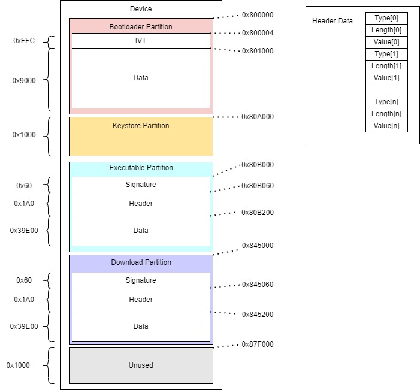<br>
_Figure 19. - System Memory Map_<br>

Depending on the mode of operation, we want these partitions to have different configurations:
* For the boot loader partition, on reset, we want this code to be **executable, readable, integrity checked, and write protected**.
* For the keystore partition, on reset, we want this code to be **non-executable, readable, integrity checked, and write protected**. 
* For the executable partition, on reset, we want this code to be **non-executable, readable, integrity checked, and write protected**. 
* For the download partition, on reset, we want this code to be **non-executable, readable, integrity checked, and writable**.
* Immediately before copying the download partition data to the executable partition, we want to switch the executable partition to non-executable, integrity checked, and writable. Once the copy is complete, we want to set the executable partition back to its original reset state (i.e. non-executable, readable, integrity checked, and write protected).
* As soon as the copy is complete, we want to switch the executable partition back to executable, readable, integrity checked, and write protected.

### Bootloader Region Configuration
In this demo flash protection region 0 is used for the boot partition (PR0).

As shown in _Figure 18_ the boot region resides in address range 0x800000-0x809FFF (inclusive).  To configure PR0 to this range, we configure the PR0ST register to 0x000 and the PR0END to 0x9.  *NOTE* - the PRnST and PRnEND registers are offset from 0x800000 and are page aligned (the lower bits are hardware restricted to force page alignment).  These options are set in the configuration bits FPR0ST and FPR0END which are copied into the PR0ST and PR0END SFRs on reset.

As noted in the description above, we want to configure the boot region to be executable, readable, integrity checked, and write protected on reset.  These options are set in the FPR0CTRL configuration register and copied into the PR0CTRL SFR on reset.  Finally, the region needs to be enabled.  *NOTE* the configuration bit is a DISABLE bit so take note on the setting when making changes.

By using the configuration bits, this ensures that the registers are loaded with the default behavior on reset.  Since we don't want this region's permissions to change, we set the region type bit (FPR0CTRL_RTYPE) to IRT (Immutable Root of Trust).  By default, the region type bit is set to FIRMWARE which allows for region locking/unlocking and permissions updates, however the most secure option for the bootloader region is to have this set as IRT and disable the locking/unlocking mechanism completely.

To ensure IRT execution is disabled, we set the IRTCTRL DONE bit before launching the executable. Additionally, the executing bootloader IRT partition must ensure that the non-IRT executable code is not prefetched before the DONE bit is set. The datasheet recommends adding at least a 32-byte buffer between the end of the IRT executable firmware and the start of the non-IRT executable firmware. This buffer ensures that the executing IRT code is not directly adjacent to the non-IRT executable space, where the prefetch cache may load the non-IRT executable space program memory before the DONE bit is set. The keystore, although designated as IRT code, is non-executable and therefore provides the recommended buffering between the executable IRT bootloader partition and the executable non-IRT executable partition. See _Figure 12_ above for the full memory map. 

Prior to transferring control to the executable partition, we also invalidate and disable the instruction cache (CHECONbits) to protect any IRT firmware code from being accessed by the non-IRT executable partition.  

*NOTE* - This configuration is used to facilitate ease of change/modification.  The dsPIC33A has permanent configuration options that lock the boot region from any changes on reset and can't be unlocked or modified, even by reprogramming.  Please see the [Production Concerns](#production-concerns) section below and the datasheet for additional information about these settings.

### Keystore Region Configuration
In this demo flash protection region 1 is used for the keystore partition (PR1).

As shown in _Figure 18_ the keystore region resides in address range 0x80A000-0x80AFFF (inclusive).  To configure PR1 to this range, we configure the PR1ST register to 0xA and the PR1END to 0xA.  *NOTE* - the PRnST and PRnEND registers are offset from 0x800000 and are page aligned (the lower bits are hardware restricted to force page alignment).  These options are set in the configuration bits FPR1ST and FPR1END which are copied into the PR1ST and PR1END SFRs on reset.

As noted in the description above, we want to configure the keystore region to be non-executable, readable, integrity checked, and write protected on reset.  These options are set in the FPR1CTRL configuration register and copied into the PR1CTRL SFR on reset.  Finally, the region needs to be enabled.  *NOTE* the configuration bit is a DISABLE bit so take note on the setting when making changes.

By using the configuration bits, this ensures that the registers are loaded with the default behavior on reset.  Since we don't want this region's permissions to change, we set the region type bit (FPR1CTRL_RTYPE) to IRT (Immutable Root of Trust).  By default, the region type bit is set to FIRMWARE which allows for region locking/unlocking and permissions updates, however the most secure option for the keystore region is to have this set as IRT and disable the locking/unlocking mechanism completely. 

*NOTE* - This configuration is used to facilitate ease of change/modification.  The dsPIC33A has permanent configuration options that lock the boot region from any changes on reset and can't be unlocked or modified, even by reprogramming.  Please see the [Production Concerns](#production-concerns) section below and the datasheet for additional information about these settings.

### Executable Region Configuration
In this demo flash protection region 2 is used for the executable partition (PR2).

As shown in _Figure 18_ the executable region resides in address range 0x80B000-0x844FFF (inclusive).  To configure PR2 to this range, we configure the PR2ST register to 0xB and the PR2END register to 0x44.  *NOTE* - the PRnST and PRnEND registers are offset from 0x800000 and are page aligned (the lower bits are hardware restricted to force page alignment).  These options are set in the configuration bits FPR2ST and FPR2END which are copied into the PR2ST and PR2END SFRs on reset.

As noted in the description above, we want to configure the executable region to be non-executable, readable, integrity checked, and write protected on reset.  These options are set in the FPR2CTRL configuration register and copied into the PR2CTRL SFR on reset.  Finally, the region needs to be enabled.  *NOTE* the configuration bit is a DISABLE bit so take note on the setting when making changes.

By using the configuration bits, this ensures that the registers are loaded with the default behavior on reset.  There is an additional SFR for each region that doesn't have a configuration bit counterpart, the PRxLOCK register.  By default on reset this register is locked.  The locked state prevents changes to the register but allows them to be unlocked.  This is important for being able to do firmware updates.  We will want to change the configuration of this section depending on the mode we are running in.  *NOTE* Unlike the bootloader and keystore regions, the FPR2CTRL_RTYPE bit is set to FIRMWARE, which allows for the use of the PRxLOCK register.     

Immediately before copying the download partition data into the executable partition, the executable region permissions are changed to enable writes, but keeps execution disabled.  As soon as the update is complete, writes are disabled again.  In this demo that is done by resetting the device as soon as a firmware update is complete to reset the boot process and thus restoring the reset protection of the executable region: non-executable, write protected, integrity checked.

When the firmware update is complete, or on a reset, if the executable partition passes all integrity checks and is determined valid, the firmware region can be switched to enable execution.  Before transferring control to the executable code to run, we also want to lock the executable region to "lock until next reset" so that the executable code is unable to modify itself, either accidentally or through malicious intent.  Only the firmware update code in the boot region is allowed to update the executable partition.

### Download Region Configuration
In this demo flash protection region 3 is used for the download firmware (PR3).

As shown in _Figure 18_ the download region resides in address range 0x845000-0x87EFFF (inclusive).  To configure PR3 to this range, we configure the PR3ST register to 0x45 and the PR3END to 0x7E.  *NOTE* - the PRnST and PRnEND registers are offset from 0x800000 and are page aligned (the lower bits are hardware restricted to force page alignment).  These options are set in the configuration bits FPR3ST and FPR3END which are copied into the PR3ST and PR3END SFRs on reset.

As noted in the description above, we want to configure the download region to be  non-executable, readable, integrity checked, and writable on reset.  These options are set in the FPR3CTRL configuration register and copied into the PR3CTRL SFR on reset.  Finally, the region needs to be enabled.  *NOTE* the configuration bit is a DISABLE bit so take note on the setting when making changes.

By using the configuration bits, this ensures that the registers are loaded with the default behavior on reset.  There is an additional SFR for each region that doesn't have a configuration bit counterpart, the PRxLOCK register.  By default on reset this register is locked.  This region should remain locked to prevent changing of permissions, as the download partition should always have execution disabled.  *NOTE* Unlike the bootloader and keystore regions, the FPR3CTRL_RTYPE bit is set to FIRMWARE, which allows for the use of the PRxLOCK register.  

### Authorized Recovery
An authorized recovery mechanism has been integrated into the demo for the developer to implement as they see fit. According to *NIST SP 800-193 - Platform Firmware Resiliency Guidelines*, section 3.5.2 - "Authorized Update Mechanism", it is recommended to use an authorized recovery method when recovering from corrupt firmware. This mechanism can range from a simple button press to confirm physical presence to a more complex method such as requiring a password.

The recovery function, MDFU_RecoveryAuthorized, is located in mdfu_recovery_authorization.c and currently returns true by default. This function is invoked in boot_demo.c within the RECOVER_FROM_DOWNLOAD bootloader state, which is triggered when the executable partition fails verification in the BOOTING state, as illustrated in  _Figure 19_ below.

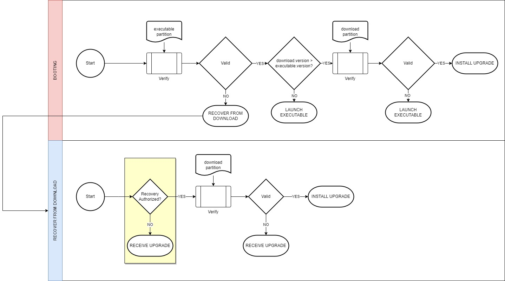<br>
_Figure 20. - Authorized Recovery_<br>

As noted above, MDFU_RecoveryAuthorized always returns true by default. Therefore, if the RECOVER_FROM_DOWNLOAD state is entered and the download image successfully verifies, the download image will be installed. 

### Converting to use loadable projects
Some developers prefer to use the loadable project features in MPLAB® X so that a bootloader and application project can be built into one .hex file.  This feature is supported by this demo, but requires some modifications to the examples provide.  The steps to enable loadable projects are:
1. Open the mdfu_config.h file in the app.X project.
2. Uncomment the MDFU_CONFIG_LOADABLE_PROJECT definition so that it is defined.
3. Open the linker file attached to the app.X project
4. Locate and uncomment the MDFU_CONFIG_LOADABLE_PROJECT definition so that it is defined.
5. Right click on the "Loadables" logical folder in the app.X MPLAB® X project. 
6. Select the boot.X as the loadable project.
7. Compile the project.  Two .hex files are generated in the production folder: one with just the application and one that is unified with the boot .hex file.  Both files have the CRC calculations applied to them.  The resulting .bin file only contains the executable image and does not contain the boot loader source.

## Demonstrating Flash Protection Regions

Additional example application projects are included in this demo under the flash_protection_examples folder, which contains three sub-folders: flash_region_erase, flash_region_read, and flash_region_execute.

---

**NOTE**: The FIRT_IRT Immutable Root of Trust Enable bit must be enabled in boot.X for the examples below to demonstrate the intended IRT protection functionality. This bit can be found and set in boot.X &rarr; mcc_generated_files &rarr; system &rarr; src &rarr; config_bits.c.

---

### Flash Region Erase Examples

The examples projects listed below are intended to verify that an IRT region cannot be erased by non-IRT code and that the boot, executable, and keystore sections are locked to modification. By modifying the boot loader code, developers can verify that if these regions are not switched to "locked until next reset" or are not IRT enabled regions, they can be unlocked and modified. These projects can be found in the flash_protection_examples folder.

* bootEraseFlashProtection.X & keystoreEraseFlashProtection.X
    * Unlocks the region and erases a page from it.
    * LED behavior:
        * LED7 blinks as a "keep alive" indicator.
        * LED6 blinks if a page from the region was successfully erased, solid if not.
        * LED2 is solid if a bus error trap was triggered due to an IRT region being accessed, blinks if not.
* executableEraseFlashProtection.X
    * Unlocks the region and erases a page from it.
    * LED behavior:
        * LED7 blinks as a "keep alive" indicator.
        * LED6 blinks if a page from the region was successfully erased, solid if not.

#### Expected Behavior 

Given the FIRT_IRT bit has been set and the projects are loaded via the firmware update mechanisms described in the [main demo](#programming-the-application), the following behavior should be observed:

* bootEraseFlashProtection.X & keystoreEraseFlashProtection.X
    * LED7 blinks.
    * LED6 is solid.
    * LED2 is solid (boot IRT region accessed, triggering a bus error trap).
* executableEraseFlashProtection.X
    * LED7 blinks.
    * LED6 is solid.

### Flash Region Read Examples

The examples projects below are intended to verify that an IRT region cannot be read by non-IRT code. They are located in the flash_protection_examples folder.

* bootReadFlashProtection.X & keystoreReadFlashProtection.X
    * Reads an instruction within the region.
    * LED behavior:
        * LED7 blinks as a "keep alive" indicator.
        * LED6 blinks if a page from the region was successfully read, solid if not.
        * LED2 is solid if a bus error trap was triggered due to an IRT region being accessed, blinks if not.

#### Expected Behavior 

Given the FIRT_IRT bit has been set and the projects are loaded via the firmware update mechanisms described in the [main demo](#programming-the-application), the following behavior should be observed:

* bootReadFlashProtection.X & keystoreReadFlashProtection.X
    * LED7 blinks.
    * LED6 is solid.
    * LED2 is solid (boot IRT region accessed, triggering a bus error trap).

### Flash Region Execute Example

The example project below is intended to verify that the IRT regions are fully protected and non-IRT user space cannot access IRT code.  It is located in the flash_protection_examples folder.

* bootExecuteFlashProtection.X
    * Jumps to an address in the IRT boot region from non-IRT user space.
    * LED behavior:
        * LED2 is solid if a bus error trap was triggered due to an IRT region being accessed.

#### Expected Behavior

Given the FIRT_IRT bit has been set and the projects are loaded via the firmware update mechanisms described in the [main demo](#programming-the-application), the following behavior should be observed:

* bootProtectionJumpExample.X
    * LED2 is solid (boot IRT region accessed, triggering a bus error trap).

## Production Concerns 
This demonstration serves as a *non-permanent* example of boot loading on the dsPIC33AK512MPS512. It allows users to program and erase the device to customize the example without permanently locking it into a specific configuration. As described above in the [Bootloader Region Configuration](#bootloader-region-configuration) and [Keystore Region Configuration](#keystore-region-configuration) sections, the boot and keystore flash protection regions are designated as Immutable Root of Trust (IRT). Unlike firmware regions, where the PRxLOCK register can be updated to lock/unlock/lock until reset, IRT regions are locked and cannot be unlocked. Although the IRT configuration provides some protection, it can be modified to a less secure setting, such as Firmware, which allows for unlocking when reprogrammed with the updated setting.

For production environments, a permanent boot and keystore region is often required. To create a fully secure boot Immutable Root of Trust, additional steps must be taken by the developer to ensure external and internal reprogramming and debugging of the IRT regions and configuration bits is permanently disabled. This can be achieved by configuring the User Configuration B (UCB) security and boot configuration bits to disable programming, writing, and erasing. This includes setting the FWPUCB (UCB Write Protection bits) and FEPUCB (UCB Page Erase Protection bits) Configuration Words to disable programming and erasing, or erasing only, respectively. Additionally the FIRT bit should be set to disable debugging a prevent reads of the IRT sections. These steps should be completed by the developer before transitioning to production.

Additionally, there are features to disable the programming/JTAG ports on the device, which should be configured to lock the configuration bit pages and secure the flash protection region configuration. These options are not enabled in the demo to allow for reuse of the development hardware but should be enabled for production purposes. 

For additional details on UCB configuration and JTAG port enabled/disable settings, please refer to the datasheet.

## Trademarks

MPLAB® is a registered trademark of Microchip Technology Inc. All other trademarks are the property of their respective owner.