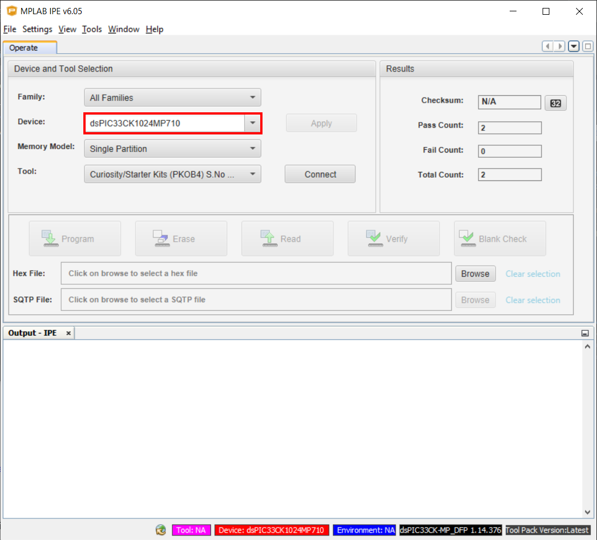
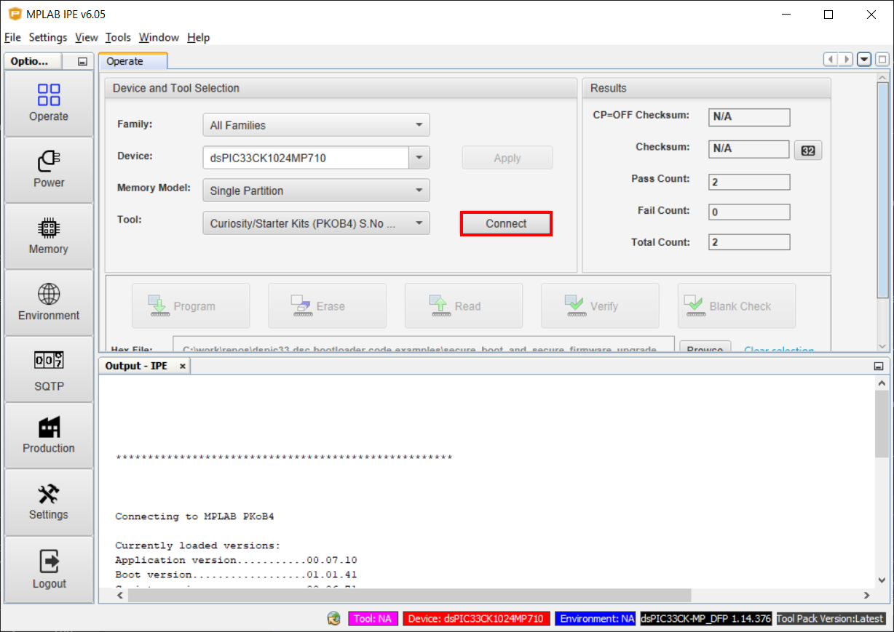
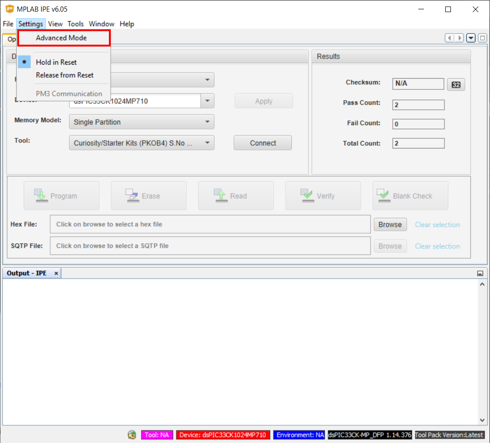
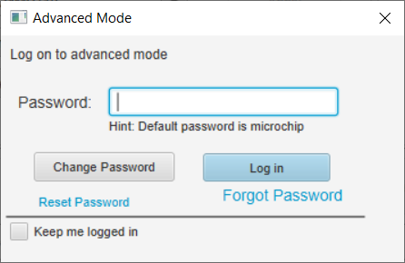
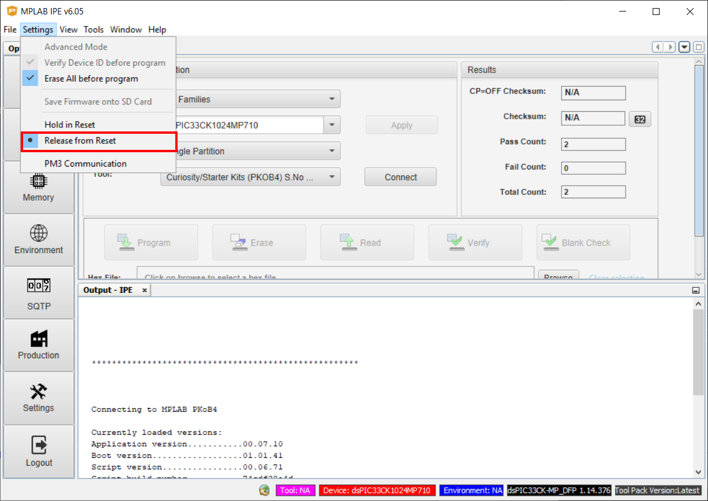
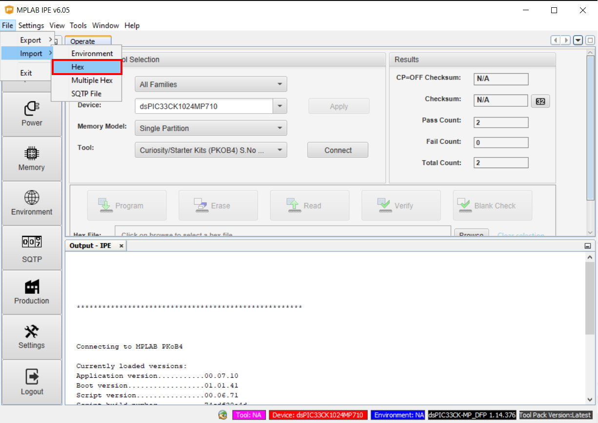
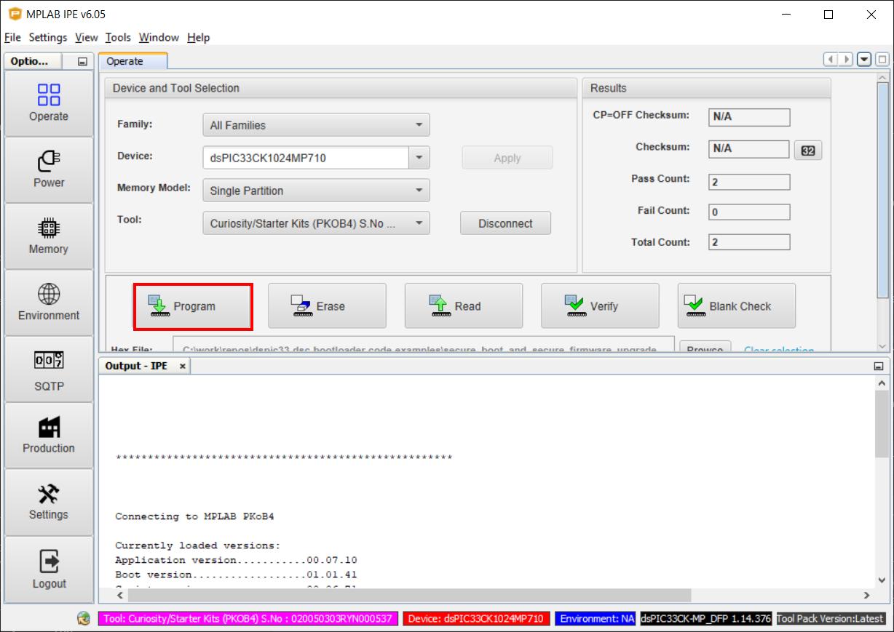

<picture>
    <source media="(prefers-color-scheme: dark)" srcset="./images/microchip_logo_white_red.png">
	<source media="(prefers-color-scheme: light)" srcset="./images/microchip_logo_black_red.png">
    
</picture>

## Secure Boot and Secure Firmware Upgrade over CAN-FD for dsPIC33C DSCs Demo - Precompiled Hex Files

## Introduction
This folder contains precompiled .hex files for the demo bootloader and application project associated with this project.  This demo uses the TA100 and associated code library which require an NDA to get access to the complete source code.  Those interested in testing the demo before going through the NDA process can use these hex files to run through the demo without needing access to the source files.

**NOTE** - Only the bootloader project has code that requires an NDA.  The application .hex file can be compiled as is and is provided out of convenience.

## Programming the Bootloader from the Precompiled .hex File
1. Connect the dsPIC33C Touch CAN LIN Curiosity Development Board to the PC via the USB micro-B port.
2. Open the MPLAB X IPE program.
3. Enter the dsPIC33CK1024MP710 in the "Device" selector. 
 
4. Select the "Curiosity/Starter kits" option from the "Tools" dropdown. 
 
5. From the menu, select "Settings -> Advanced Mode" 
 
6. Enter the IPE password.  The default password is "microchip" if a new password has not been selected yet.  
 
7. From the menu, select "Settings -> Release from Reset".  This will allow the programmer to release the device from reset after a programming is complete and allow the device to run the new code. 
 
8. From the menu, select "File -> Import -> Hex".  Select the following file: `/secure_boot_and_secure_firmware_upgrade_over_canfd/hex_files/boot.X.production.hex`. 
 
9. Click the "Connect" button. 
 
10. Once the connection is complete, press the "Program". 
 
11. When programming is complete, the bootloader should now be operational.  You can continue to use the bootloader using the `README.md` documentation found in the boot.X folder that is one level higher in this directory structure.

## Loading and Running the Application
Use the `README.md` file in the top-level folder of the demo for the full instructions of the how to load the application using the bootloader.  When prompted to load a .hex file, you can choose to load the application file located here instead of compiling the application project and using the resulting .hex file.
