<picture>
    <source media="(prefers-color-scheme: dark)" srcset="../images/microchip_logo_white_red.png">
	<source media="(prefers-color-scheme: light)" srcset="../images/microchip_logo_black_red.png">
    
</picture>

## Secure Boot and Secure Firmware Upgrade over CAN-FD for dsPIC33C DSCs Demo - ICSP Inhibit

#### ICSP Inhibit
---
> **_!!WARNING!!_** 
**Running the icsp_inhibit.X application and following the steps outlined in the resulting console will PERMANENTLY DISABLE direct programming and debugging of the board. For additional information, see section 5.5: Flash OTP by ICSP Write Inhibit of the [dsPIC33CK1024MP708 Family Data Sheet](https://ww1.microchip.com/downloads/aemDocuments/documents/MCU16/ProductDocuments/DataSheets/dsPIC33CK1024MP710-Family-Data-Sheet-DS70005496.pdf).**

---

## Introduction
This project contains an application which, when programmed properly via the bootloader, prevents alteration of all Flash memory and permanently disables direct programming and debugging of the board. Once programmed, ICSP inhibit cannot be deactivated. 

All software and hardware are the same as those used in boot.X and app.X. See the README.md file in the top-level folder of the demo for additional tool setup instructions. 

## Running the Demo

#### Programming the Bootloader
**NOTE: The ICSP inhibit functionality can only be programmed via bootloader. Direct download of the icsp_inhibit.X application will prevent the ICSP inhibit feature from being installed.**
1. Open the boot.X project in MPLAB® X
2. Open MCC
3. Right click on Project Resources and select "Force Update on All" 
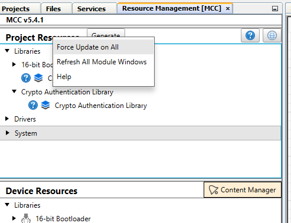
4. Click "Generate" 
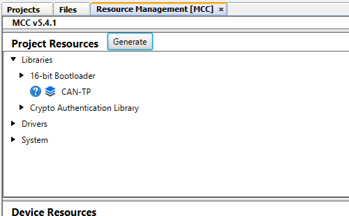
5. Accept all incoming code changes for files **within the CryptoAuthenticationLibrary directory** by selecting "Replace All" in the merge helper UI  **NOTE: DO NOT accept incoming changes for boot_demo.c. Accept all other file changes and close out of MCC** 
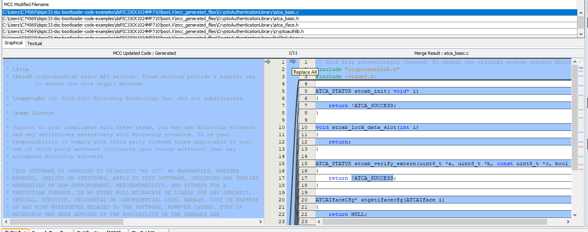
6. Press the “Make and Program” button on the top bar 
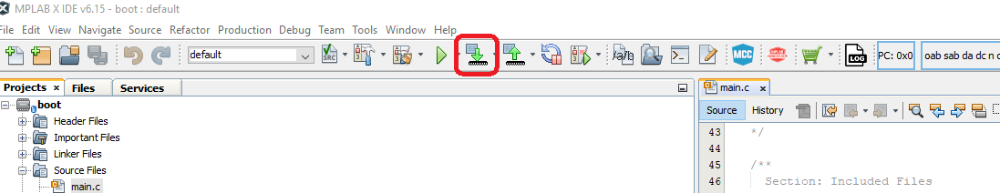
7. Select the appropriate programmer if prompted
8. The project should compile and program successfully
9. Verify the LED11 is solid on the Development Board. This indicates the bootloader is running
    
#### Building the ICSP Inhibit Application
1. Open the icsp_inhibit.X project in MPLAB® X
2. Click the dropdown arrow next to the “Clean and Build Project” button on the top bar and select "Clean and Build Project"  **NOTE**: If "Clean and Build for Debugging" is selected instead, a new hex file will not be generated  **NOTE**: Make sure not to hit the program button. This will program the application code over the bootloader that was just programmed 
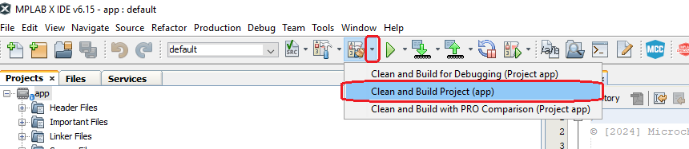
3. The project should compile cleanly. icsp_inhibit.X/dist/default/production/icsp_inhibit.X.production.hex should be generated
4. Verify that LED11 is still solid
    a. If LED11 is blinking instead of solid, then the application code was programmed instead of only compiled. Go back to the “Programming the Bootloader” stage and re-program the bootloader

#### Loading the Application
**NOTE: The ICSP inhibit functionality will only be programmed once the steps in Locking the Device have been completed successfully. The steps listed in this section (Loading the Application) will not permanentley alter the device**
1. Open the Universal Bootloader Host Application tool (UBHA) 
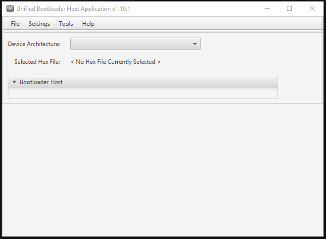
2. Select the “PIC24/dsPIC” option from the “Device Architecture” selection drop down 
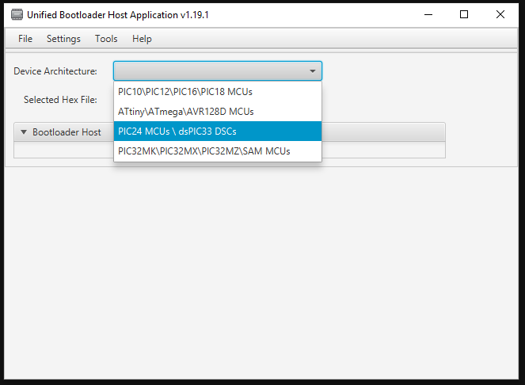
3. Select “CAN” from the protocol drop down selection box 
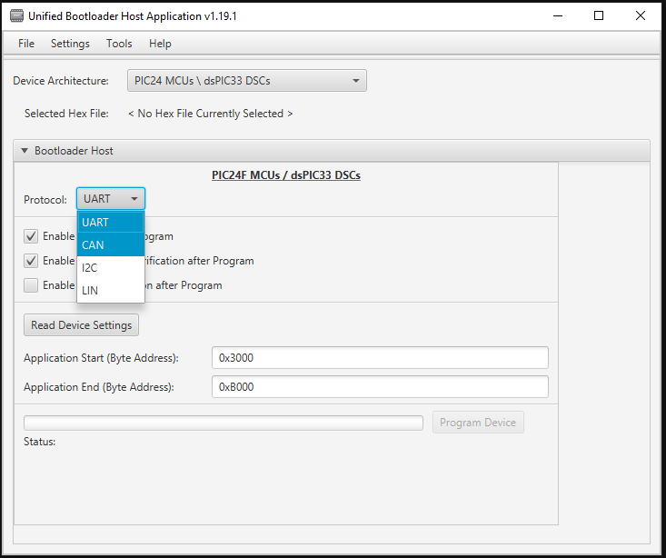
4. Select the “Settings->CAN” option from the top menu 
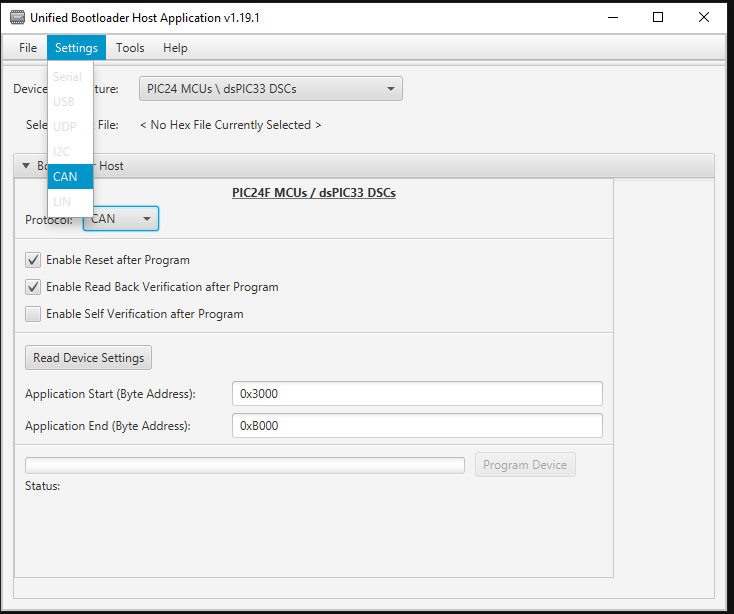
5. Select the Peak protocol analyzer being used and the appropriate CAN configuration settings for this demo (listed below). When complete, press “Apply”: 
    a. Nominal Bit Rate: 125.00 kbits/s
    b. CAN-FD: enabled
    c. CAN-FD TX Data Length: 8
    d. Flexible Data Rate: Enabled 
    e. Flexible Data Rate: 2Mbits/s
    f. Message Format: Standard
    g. Host to Device ID: 0xA1
    h. Device to Host ID: 0xA2 
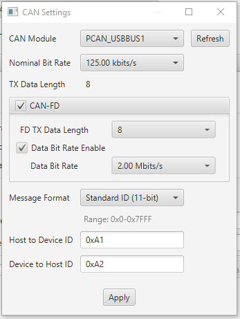
6. Press the "Read Device Settings" button
    a. The Application start address and Application end address fields should have updated. If it did not or if you get a communication error, please go back to the “Programming the Bootloader” stage to make sure the bootloader was programmed correctly 
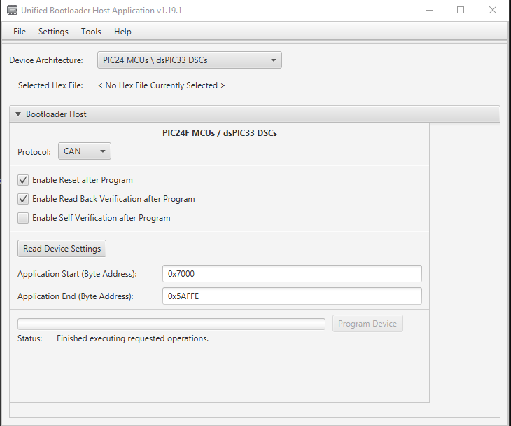
7. Load the application hex file by selecting “File->Open/Load File (*.hex)”
    a. Select the file generated in the previous section: icsp_inhibit.X/dist/default/production/icsp_inhibit.X.production.hex 

8. Check the "Enable Self Verification After Program" checkbox 
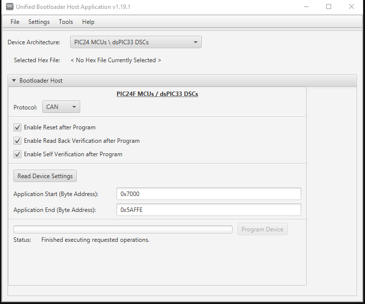
9. Press “Program Device”. The application should program erase, program and perform a self verify using the TA100 for an ECDSA verify then read back verify correctly. **NOTE**: The reset response may not be fully transmitted before reset which may result in the reset response failing. The reset most likely did occur and the error can be safely ignored 
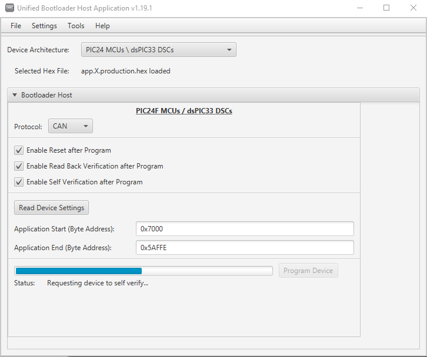

#### Locking the Device
1. Open a terminal emulator program such as Tera Term and connect to the COM port used by the device. If the COM port is unknown: 
    1. Open UBHA
    2. Select "UART" from the protocol drop down selection box 
    
    3. Select the “Settings->Serial” option from the top menu 
    
    4. With the micro-USB cable connected to port J1 of the Development Board, click the COM Port dropdown and note the COM ports listed 
    
    5. Unplug the micro-USB cable from port J1 and click the Refresh button in the Port Settings next to the COM Port dropdown
    6. Click the COM Port dropdown and note which COM port is missing. This is the port that is being used by the device 
2. Run the application. Text should appear in the console indicating the ICSP inhibit application is running 
3. **!!NOTE: THE FOLLOWING WILL PERMANENTLY LOCK THE DEVICE, DISABLING PROGRAMMING AND DEBUGGING** In all CAPS type, "LOCKDEVICE" and hit enter. Flash memory is not restricted and the board is locked from any programming or debugging.  

## Trademarks

MPLAB® is a registered trademark of Microchip Technology Inc. All other trademarks are the property of their respective owner.
