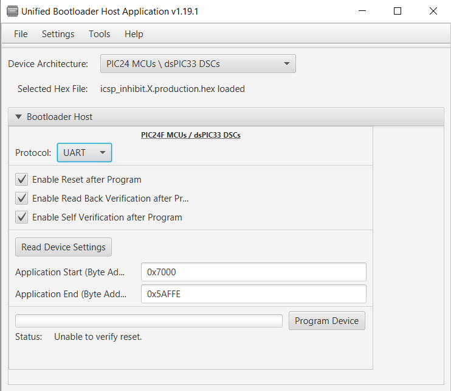
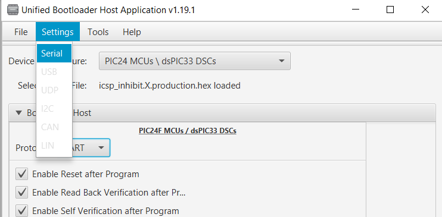
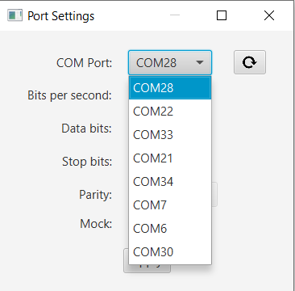
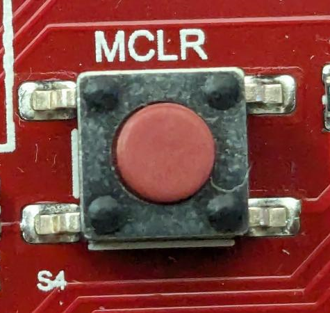
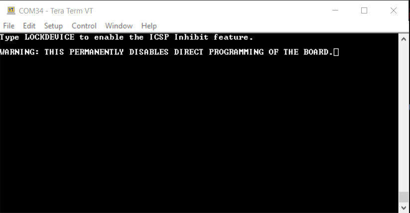
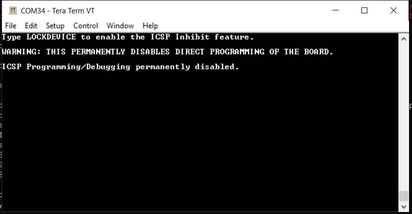

<picture>
    <source media="(prefers-color-scheme: dark)" srcset="../images/microchip_logo_white_red.png">
	<source media="(prefers-color-scheme: light)" srcset="../images/microchip_logo_black_red.png">
    
</picture>

## Secure Boot and Secure Firmware Upgrade over CAN-FD for dsPIC33C DSCs Demo - ICSP Inhibit
---
> **_!!WARNING!!_** 
**Running the icsp_inhibit.X application and following the steps outlined in the resulting console will PERMANENTLY DISABLE direct programming and debugging of the board. For additional information, see section 5.5: Flash OTP by ICSP Write Inhibit of the [dsPIC33CK1024MP708 Family Data Sheet](https://ww1.microchip.com/downloads/aemDocuments/documents/MCU16/ProductDocuments/DataSheets/dsPIC33CK1024MP710-Family-Data-Sheet-DS70005496.pdf).**

---

## Introduction
This project contains an application which, when programmed properly via the bootloader, prevents alteration of all Flash memory and **PERMANENTLY** disables direct programming and debugging of the board. Once programmed, ICSP inhibit cannot be deactivated. 

All tool setup and programming instructions for the bootloader and application are the same as those used in boot.X and app.X, however the icsp_inhibit.X project will be used in place of app.X referenced in the README.md file in the top-level folder. For additional details on tool setup and how to run the demo, see the [README.md](../README.md) file in the top-level folder. 

**NOTE: The ICSP inhibit functionality can only be programmed via bootloader. Direct download of the icsp_inhibit.X application will prevent the ICSP inhibit feature from being installed.**

## Running the Demo

#### Building the Bootloader
* See the [README.md](../README.md) file in the top-level folder. 
    
#### Building the ICSP Inhibit Application
* See the [README.md](../README.md) file in the top-level folder. **NOTE: The icsp_inhibit.X application does not utilize a blinking LED to indicate the application is running** 

#### Loading the Application
* See the [README.md](../README.md) file in the top-level folder. 
**NOTE: The ICSP inhibit functionality will only be programmed once the steps in Locking the Device have been completed successfully. The steps listed in this section (Loading the Application) will not permanentley alter the device**
**NOTE: When prompted in the instructions, utilize the hex file located at icsp_inhibit.X/dist/default/production/icsp_inhibit.X.production.hex**
**NOTE: The icsp_inhibit.X application does not utilize a blinking LED to indicate the application is running** 

#### Locking the Device
1. Open a terminal emulator program such as Tera Term and connect to the COM port used by the device. If the COM port is unknown: 
    1. Open UBHA.
    2. Select "UART" from the protocol drop down selection box. 
    
    3. Select the “Settings->Serial” option from the top menu. 
    
    4. With the micro-USB cable connected to port J1 of the Development Board, click the COM Port dropdown and note the COM ports listed. 
    
    5. Unplug the micro-USB cable from port J1 and click the Refresh button in the Port Settings next to the COM Port dropdown.
    6. Click the COM Port dropdown and note which COM port is missing. This is the port that is being used by the device. 
2. Hit the MCLR button located in the middle of the board. Text should appear in the console indicating the ICSP inhibit application is running.  
 

3. **!!NOTE: THE FOLLOWING WILL PERMANENTLY LOCK THE DEVICE, DISABLING PROGRAMMING AND DEBUGGING.** In all CAPS type, "LOCKDEVICE" and hit enter. Flash memory is not restricted and the board is locked from any programming or debugging.  

## Trademarks

MPLAB® is a registered trademark of Microchip Technology Inc. All other trademarks are the property of their respective owner.
